# 06/2025

### **Esta atualização atende a tickets de clientes**

# Documentação 📝

## Limpeza das tabelas relacionadas aos VTs [#225](https://github.com/simixsistemas/Simix.Ponto.Calc/pull/225)

### Objetivo
Fix:#

### Alterações
- Comandos para limpar tabelas relacionadas ao VT

### Demonstração

## Ajuste ao carregar funcionários PontoCalcs/PontoCalc [#224](https://github.com/simixsistemas/Simix.Ponto.Calc/pull/224)

### Objetivo
Fix:#211

### Alterações
- Ajuste para utilizar VFuncionarios na função de carregar colaboradores na PontoCalcs/PontoCalc

### Demonstração
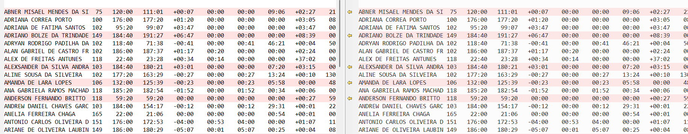

## Verificação prêmio Índio ♻ [#223](https://github.com/simixsistemas/Simix.Ponto.Calc/pull/223)

### Objetivo

Fix: [#221](https://github.com/simixsistemas/Simix.Ponto.Calc/issues/221)

### Alterações
- Realizamos a validação dos prêmios do cliente Índio, ajustamos principalmente a validação das regras de prêmio dias e ajustamos o SalvarCache dos prêmios, para salvar somente um prêmio caso tenha sido perdido e não todos. 

### Demonstração
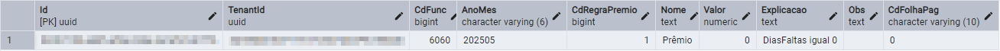

## Gravação TenantID classes VT e VR [#219](https://github.com/simixsistemas/Simix.Ponto.Calc/pull/219)

### Objetivo
Fix:#374

### Alterações
- Gravação do TenantId nas classes VT e VR

## Duplicidade ao mesclar ♻ [#218](https://github.com/simixsistemas/Simix.Ponto.Calc/pull/218)

### Objetivo
Fix: https://github.com/simixsistemas/Simix.Ponto.Cloud/issues/367

### Alterações
- Realizamos o tratamento na mesclagem das marcações e adicionamos mais casos de testes no projeto.

## Ajuste duplicidade ao mesclar♻ [#217](https://github.com/simixsistemas/Simix.Ponto.Calc/pull/217)

### Objetivo

Fix: [#367](https://github.com/simixsistemas/Simix.Ponto.Cloud/issues/367)

### Alterações
- 

## Ajustes regras prêmios ♻ [#214](https://github.com/simixsistemas/Simix.Ponto.Calc/pull/214)

### Objetivo

Fix: [#150](https://github.com/simixsistemas/Simix.Ponto.Calc/issues/150)
Fix: [#215](https://github.com/simixsistemas/Simix.Ponto.Calc/issues/215)

### Alterações
- Realizamos ajustes nas classes responsáveis pelas regras de premio e comparamos a execução do banco do cliente Brunetto no Simix Ponto e no PcPonto, validando os resultados emitidos.
- Salvamos os dados dos prêmios para que possamos utiliza-los nos dashboards.

### Demonstração

## Ajuste na gravação dos VTs e no cálculo de horas faltas sem compensação [#213](https://github.com/simixsistemas/Simix.Ponto.Calc/pull/213)

### Objetivo
Fix:#211

### Alterações

- Ajuste na opção sem compensação da coluna de manutenção do ponto.
- Ajuste na gravação da tabela FuncVTsMesDias.

##Demonstração
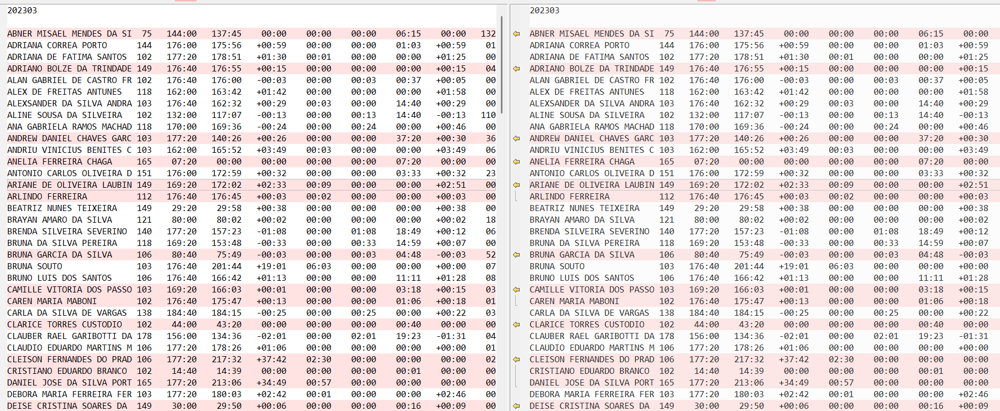

## Atualização das libs ♻ [#212](https://github.com/simixsistemas/Simix.Ponto.Calc/pull/212)

### Objetivo

PR relacionado: https://github.com/simixsistemas/Simix.Ponto.Cloud/pull/394

### Alterações

- Atualização das libs

## Filtros e layout Json ✨ [#210](https://github.com/simixsistemas/Simix.Ponto.Calc/pull/210)

### Objetivo

Filtro sql e layout json para salvar/carregar.

### Alterações

- Logica do filtro sql
- Logica do layout json
- Evento Progresso

### Demonstração

- Cases de teste no `ProcessoScriptsTeste`

## Ajuste VTs códigos [#209](https://github.com/simixsistemas/Simix.Ponto.Calc/pull/209)

## Estrutura dos processos para scripts simples ✨ [#207](https://github.com/simixsistemas/Simix.Ponto.Calc/pull/207)

### Objetivo

Fix: #208

### Alterações

- Implementação da logica de execução
- Criação das classe auxiliares de Condições e Resultados
- Caso de teste real (Lançar folgas automáticas.smxscr)

## Ajustes na MdAnoMes.🐛 [#205](https://github.com/simixsistemas/Simix.Ponto.Calc/pull/205)

### Objetivo

Ao importar registros mobile no dia **30/04** o dia acabava sumindo da manutenção. Analisado que estava inserindo o dia **30/04** como se pertencesse ao AnoMes **202505**.
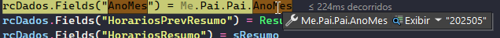

### Alterações
- Realizado a conversão novamente da função **b_DataIniFim2AnoMes** do vb6 para o vb.net.
- Realizado testes com dias 30, 31 e 1 de cada mês.

## Ajustes no Calcular BH/Dados ♻ [#204](https://github.com/simixsistemas/Simix.Ponto.Calc/pull/204)

## Ajustes testes ponto Lebes ♻ [#203](https://github.com/simixsistemas/Simix.Ponto.Calc/pull/203)

### Objetivo

Fix: [#196](https://github.com/simixsistemas/Simix.Ponto.Calc/issues/196)

### Alterações
- Realizamos tratamentos na mesclagem das marcações e no carregamento das informações mensais.
- Utilizamos TestarPontoCalcsGeral para testar o carregamento dos dados mensais e utilizamos o TestarMesclar para verificar os casos, como eram genéricos não precisamos realizar casos específicos.

## Estrutura para processos ✨ 🧪 [#202](https://github.com/simixsistemas/Simix.Ponto.Calc/pull/202)

## Classes VR/VT [#201](https://github.com/simixsistemas/Simix.Ponto.Calc/pull/201)

### Objetivo
Fix:#124

### Alterações

- Classes VT/VR e Configurações.

## Ajustes Exportação da folha.🐛  [#200](https://github.com/simixsistemas/Simix.Ponto.Calc/pull/200)

### Objetivo

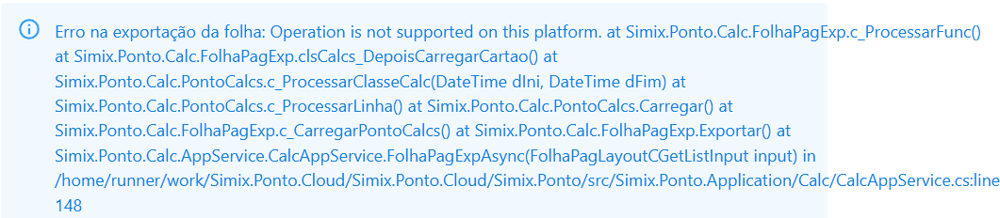

### Alterações
- Ajustado componente de formatação que era incorreto com o Linux.

## Campos novos - Registro ✨ [#198](https://github.com/simixsistemas/Simix.Ponto.Calc/pull/198)

### Objetivo

Fix: [#321](https://github.com/simixsistemas/Simix.Ponto.Cloud/issues/321)

### Alterações
- Criamos os campos Latitude, Longitude, Endereco e GPSPrecisao.

## Ajustes PontoCalcDiaImportacao.♻ [#195](https://github.com/simixsistemas/Simix.Ponto.Calc/pull/195)

### Objetivo

Ajustes gerais para importação.

### Alterações
- Ajuste na lógica para salvar o registro.
- Ajusta para salvar o TenantId e o login.
- Retirado **MsgBox**, deixado para estourar excepition.

## Ajuste na tolerância do 3 turno. [#194](https://github.com/simixsistemas/Simix.Ponto.Calc/pull/194)

### Objetivo
Fix:#189

### Alterações

- Ajuste na tolerância do 3 turno.

##Demonstração

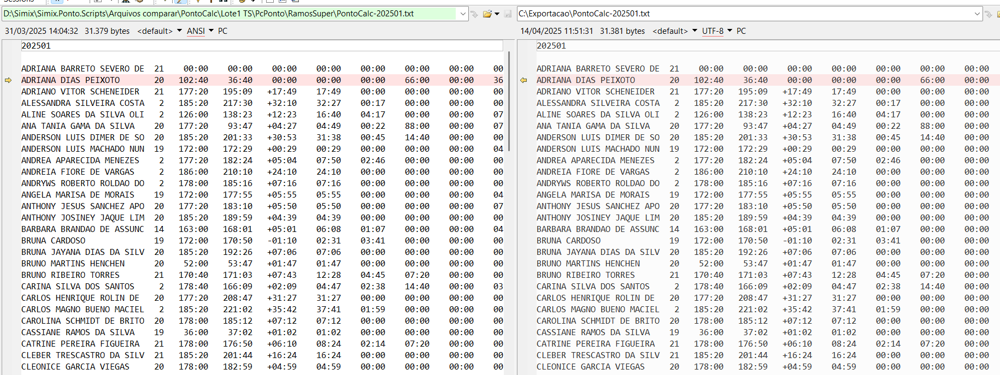

## Ajuste na tolerância quando o registro é realizado no 3 turno [#193](https://github.com/simixsistemas/Simix.Ponto.Calc/pull/193)

### Objetivo
Fix:#175

### Alterações

- Ajuste na tolerância quando o registro é realizado no 3 turno

## Migração últimas alterações PcPonto ♻ [#192](https://github.com/simixsistemas/Simix.Ponto.Calc/pull/192)

### Objetivo

Fix: [#314](https://github.com/simixsistemas/Simix.Ponto.Cloud/issues/314)

### Alterações
- Migração das ultimas alterações do PcPonto para o Simix Ponto.

## Ajustes na PontoCalcPontoEstat*. ♻ [#190](https://github.com/simixsistemas/Simix.Ponto.Calc/pull/190)

### Objetivo

Fix: [#297](https://github.com/simixsistemas/Simix.Ponto.Cloud/issues/297)

### Alterações
- Realizado ajustes nas propriedades pais.

## Ajuste na opção de contabilizar feriado em tipo de repouso remunerado misto [#188](https://github.com/simixsistemas/Simix.Ponto.Calc/pull/188)

### Objetivo
Fix:#175

### Alterações

- Ajuste na opção de contabilizar feriado em tipo de repouso remunerado misto.

## Ajustes gerais registros ♻ [#187](https://github.com/simixsistemas/Simix.Ponto.Calc/pull/187)

### Objetivo

Fix: [#300](https://github.com/simixsistemas/Simix.Ponto.Cloud/issues/300)

### Alterações
- Realizamos o tratamento da situação do registro para caso ocorra algum problema 

### Demonstração
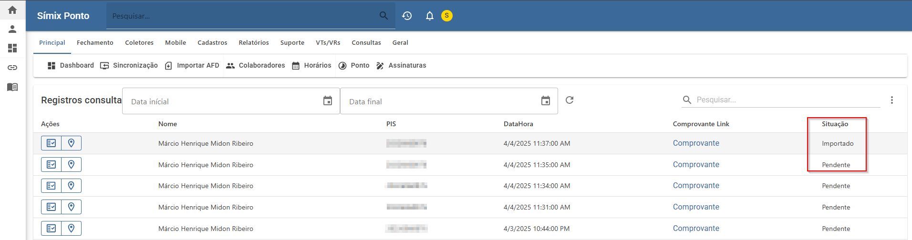

## Testes Símix [#186](https://github.com/simixsistemas/Simix.Ponto.Calc/pull/186)

## Ajustes para o Calcular Dados ♻ [#185](https://github.com/simixsistemas/Simix.Ponto.Calc/pull/185)

## Ajustes importação mobile.🐛 [#184](https://github.com/simixsistemas/Simix.Ponto.Calc/pull/184)

### Objetivo

### Alterações
- Ajustes de queries.
- Adicionado tratamento de nothing e .Count.
- Ajuste na propriedade Cor do botão

## Ajuste ao adicionar o TenantId no registro ♻ [#183](https://github.com/simixsistemas/Simix.Ponto.Calc/pull/183)

### Objetivo
- Tratar registrar.

### Alterações
- Realizamos o tratamento no registro, ao registrar será inserido o TenatId.

## Ajuste nos feriados cadastrados de UF com cidades [#182](https://github.com/simixsistemas/Simix.Ponto.Calc/pull/182)

### Objetivo
Fix:#175

### Alterações

- Ajuste nos feriados cadastros com UF e código de cidade ao mesmo tempo

## Importação de registros mobile.✨ [#181](https://github.com/simixsistemas/Simix.Ponto.Calc/pull/181)

### Objetivo

Fix: [#235](https://github.com/simixsistemas/Simix.Ponto.Cloud/issues/235)

### Alterações
- Realizado ajustes na **PontoMobileAcao** e **mdMobile,** para importação de registros mobile.
- Ajusta da formatação da query da **mdPontoCalc**
- Atualizado testes e base.

### Demonstração

## Ajustes mesclar motoristas ♻ [#180](https://github.com/simixsistemas/Simix.Ponto.Calc/pull/180)

### Objetivo
- Realizar tratamentos mesclar motoristas.

### Alterações
- Ajuste no ponto da TBMLog, não estava carregando corretamente os funcionários, após o ajuste carregou corretamente. 

### Demonstração

## Ajuste na função de verificação de horários, antes e pós fim do dia/inicio do dia [#179](https://github.com/simixsistemas/Simix.Ponto.Calc/pull/179)

### Objetivo
Fix:#175

### Alterações

- Ajuste na função de verificação de horários antes e pós fim e inicio do dia, alterado para utilizar minutos ao invés de horas.
- Ajuste no retorno da opção de faltas sem compensações

### Demonstração
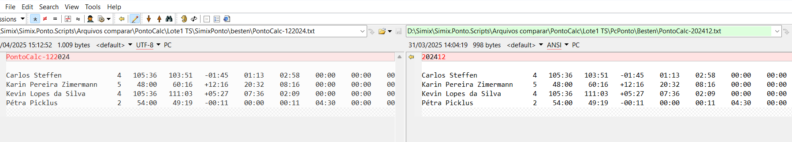
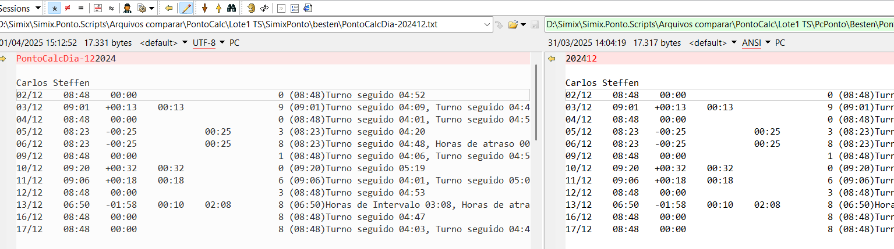
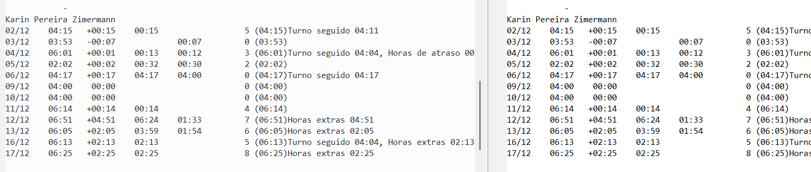
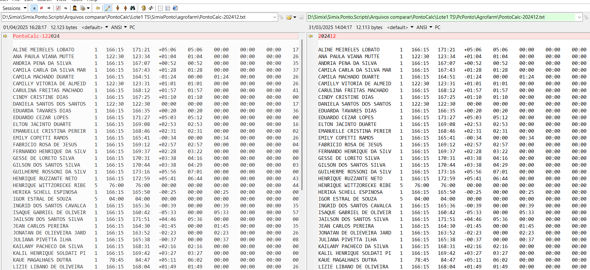

## Ajustes conferencia ♻ [#178](https://github.com/simixsistemas/Simix.Ponto.Calc/pull/178)

### Objetivo

Fix: [#176](https://github.com/simixsistemas/Simix.Ponto.Calc/issues/176)

### Alterações
- Agrobrasinha - Na comparação pegou dia 22 como inicio da ANA BEATRIZ MENEGUELLO no entanto em ambos os bancos esta como período inicial 01 na configuração do PcPonto/SimixPonto.
- Mesclar do banco ponto_mmas esta corrigido.
- Acentos ajustados.
- Casos de testes criados: DiaDeInicioPeriodo e RegistrosDias

## Ajustes erros de geração PontoCalc.♻ [#177](https://github.com/simixsistemas/Simix.Ponto.Calc/pull/177)

### Objetivo

Fix: [#287](https://github.com/simixsistemas/Simix.Ponto.Cloud/issues/287)

### Alterações
- Ajuste na formatação de queries.
- Ajuste de formatação de datas.

## Adição TenatId no registro do ponto♻ [#174](https://github.com/simixsistemas/Simix.Ponto.Calc/pull/174)

### Objetivo
- Ajustes após testes gerais.

### Alterações
- Implementamos o TenantId ao salvar o registro do ponto.

## Ajustes mesclar ♻ [#173](https://github.com/simixsistemas/Simix.Ponto.Calc/pull/173)

### Objetivo

Fix: [#170](https://github.com/simixsistemas/Simix.Ponto.Calc/issues/170)

### Alterações
- Realizamos os testes do Mesclar dos registros no layout livre.
- Realizamos os testes do Mesclar dos registros no layout padrão.
- Realizamos os testes do Mesclar dos registros após o horário de fim do dia e antes do horário de fim do dia.

### Demonstração

## Ajuste no calculo do desconto de repouso [#172](https://github.com/simixsistemas/Simix.Ponto.Calc/pull/172)

### Objetivo

### Alterações

- Ajuste ao carregar dados do quadro de horário

## Ajuste para segunda faixa de extras úteis ♻ [#171](https://github.com/simixsistemas/Simix.Ponto.Calc/pull/171)

## PontoCalcDiaImportação - ID ♻ [#168](https://github.com/simixsistemas/Simix.Ponto.Calc/pull/168)

### Objetivo

Fix: [#566](https://github.com/simixsistemas/Simix.Ponto.Cloud.Servicos/issues/566)

### Alterações
- Realizamos a adição do campo ID na classe PontoCalcDiaImportação e fizemos os tratamentos para quando inserido ou quando não inserido este valor.

### Demonstração
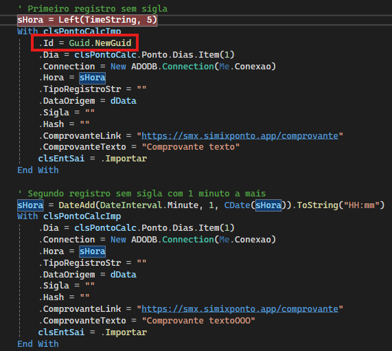

## Ajuste classes horário por dia e extras dia [#167](https://github.com/simixsistemas/Simix.Ponto.Calc/pull/167)

### Objetivo

Fix: #159

### Alterações

- Ajuste nas classes referentes ao horário por dia e carregar faixas de extras do horário por dia
- Adicionado tabela HorariosDiaFExtras

## Ajustes TODO Migrar ♻ [#166](https://github.com/simixsistemas/Simix.Ponto.Calc/pull/166)

### Objetivo

### Alterações

- Tratamento das datas
- Atualização Libs
- Criação dos testes

### Demonstração

## Novas propriedades - PontoCalcDiaImportacao✨ [#165](https://github.com/simixsistemas/Simix.Ponto.Calc/pull/165)

### Objetivo

Fix: [#567](https://github.com/simixsistemas/Simix.Ponto.Cloud.Servicos/issues/567)

### Alterações
- Realizamos a criação das propriedades: Hash, ComprovanteTexto e ComprovanteLink

## Ajustes DLL.♻ [#164](https://github.com/simixsistemas/Simix.Ponto.Calc/pull/164)

### Objetivo
Fix:[#162](https://github.com/simixsistemas/Simix.Ponto.Calc/issues/162)
- Ajustar divergências encontradas na conferência de dados.

### Alterações
- Ajustado **b_DiaSemana** para considerar o dia da semana sempre o mesmo. Independente do idioma.
- Ajustado **Item** da **PontoQHorarios**. Quando tinha horário por período, considerava somente ele.
- Ajuste na **PontoFeriado** e **PontoFeriados**, não estava carregando corretamente os feriados.
- Retirado o **TODO:Migrar Urgente** da **PontoEHorariosDia**, e ajustado para carregar os horários.
- Ajustado alguns **Format**.

## Exportar (Json/Yaml) e logs para conferências ✨ [#163](https://github.com/simixsistemas/Simix.Ponto.Calc/pull/163)

### Objetivo

Fix: https://github.com/simixsistemas/Simix.Ponto.Cloud/issues/247

### Alterações

- Novos métodos para exportar qualquer classe para Json ou Yaml
- Ajustes gerais identificados ao exportar (como percorre todas as propriedades algumas estavam com erro)
- Criação do teste
- Atualização das libs

### Demonstração

## Ajustes para carregar e exibir valores da PontoQHorarios.♻ [#161](https://github.com/simixsistemas/Simix.Ponto.Calc/pull/161)

### Objetivo

Fix: [#158](https://github.com/simixsistemas/Simix.Ponto.Calc/issues/158)

- Não fazia a busca corretamente na lista object que retornava da **RecordSet**

### Alterações
- Ajustado a função **b_DiaSemana** para retornar corretamente o nome do dia da semana. Ex: **Dom**. Antes: **dom.**
- Adicionado um replace na função para poder realizar a concatenação correta com os turnos. Ex: **DomT1E**. Antes: **dom.T1E**
- Ajuste para buscar por **True**, na lista do recordset.
- Retirado o  **'TODO: Migrar** da RegrasIncons e ajustado os erros.

## Verificar diferença nos scripts da PontoCalc.♻ [#160](https://github.com/simixsistemas/Simix.Ponto.Calc/pull/160)

### Objetivo

Fix: [#158](https://github.com/simixsistemas/Simix.Ponto.Calc/issues/158)

### Alterações
- Ajuste na formatação **AnoMes** e ajuste na **Chave**. PontoQHorarios.
- Ajuste na query de **PontoTurnosEsp**, estava retornando dados de periodo errado. PontoCalcPonto.
- Ajuste na formatação **AnoMes** para retornar dados de Periodos bloqueados/liberados. PontoCalc.
- Ajuste na formatação **AnoMes**. PontoBH.
- Criado teste da PontoCalcs para simular o script e gerar erros, caso houver para debuggar.

### Demonstração
- PontoCalcDia
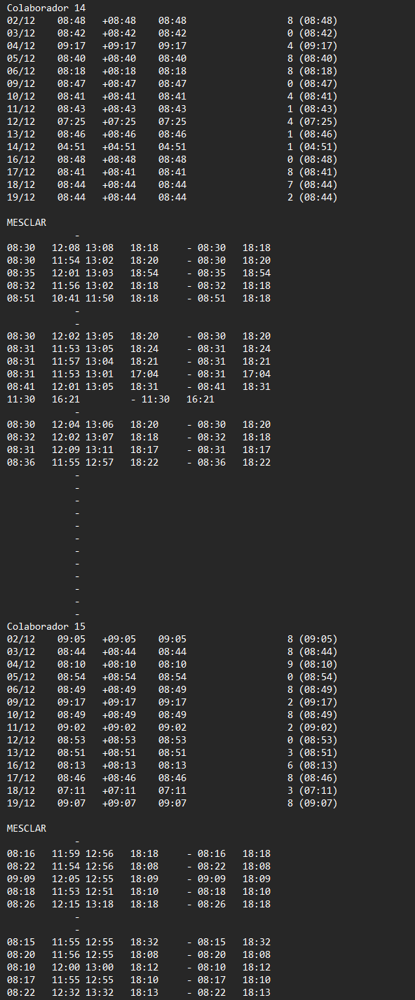

- PontoCalc
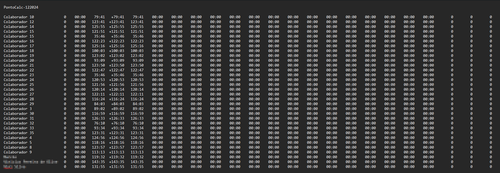

- Comparação Ponto_smx script atual/script PcPonto
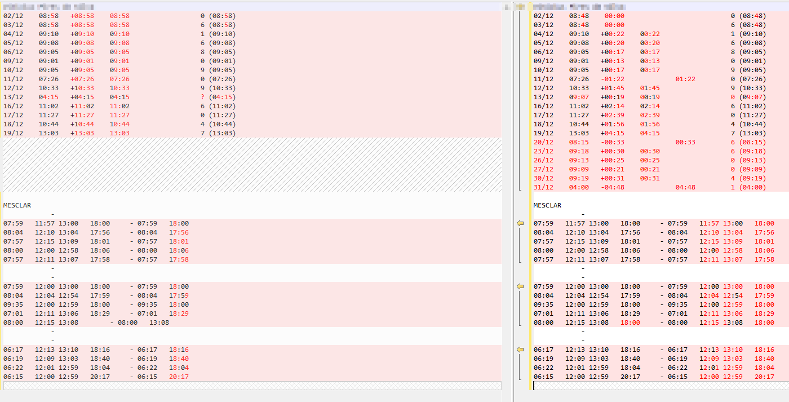

## Ajustes testes Cloud [#157](https://github.com/simixsistemas/Simix.Ponto.Calc/pull/157)

## Ajustes gerais e mais testes unitários na PontoCalc ♻ [#155](https://github.com/simixsistemas/Simix.Ponto.Calc/pull/155)

### Objetivo

Fix: https://github.com/simixsistemas/Simix.Ponto.Calc/issues/154

### Alterações

- Criado testes mais completos para a PontoCalc/PontoCalcs
- Tratamento de erros identificados na PontoCalcDiaTurnos
- Resolvido alguns `'TODO: Migrar`

## Ajustes e tratamentos. ♻ [#153](https://github.com/simixsistemas/Simix.Ponto.Calc/pull/153)

### Objetivo

Fix: [#152](https://github.com/simixsistemas/Simix.Ponto.Calc/issues/152)

### PR's referência
- [Tratamentos na FuncMes.♻](https://github.com/simixsistemas/Simix.Ponto.Cloud/pull/225)

### Alterações
- Adicionado tratamento de parâmetro parser na Recordset para fazer ou não a formatação da query.
- Descomentado algumas funções e realizado o tratamento para o funcionamento no **postgresql**.
- Adicionado Testes de registros para verificação de código recém computado.
- Adicionado colunas faltantes pra importação na **PontoTurnosEsp.** E ajustado para importar o Id.
- Ajuste de erros de index.
- Adicionado tratamento na query da **PontoLog**, dependendo do fuso horário configurado no servidor, acabava impedindo a busca num formato x de DataHora

## Classes PontoBH [#151](https://github.com/simixsistemas/Simix.Ponto.Calc/pull/151)

### Objetivo

### Alterações

- Classes ajustadas e testadas
PontoBH
PontoBHMes
PontoBHMeses
PontoBHConfig
PontoBHConfigs
PontoBHLanc
PontoBHLancs
PontoBHExtra
PontoBHExtras

## Coleção genérica com Chave/QHorarios ✨ [#149](https://github.com/simixsistemas/Simix.Ponto.Calc/pull/149)

### Objetivo

Fix: #146 

### Alterações

- Melhorias na `ColecaoBase` para usar uma lista e dicionário para trabalhar mais fácil/rápido com as chaves
- Criado os métodos genéricos na base: Add*, Existe, Item, Remove e Clear
- Criada a Interface `IChave` para cada classe implementar qual seu campo chave
- Realizado diversos pequenos ajustes nas classes Ponto* para compatibilizar
- Criado os testes para os principais cenários (_em andamento_)

## Opção para salvar TenantId. ✨ [#148](https://github.com/simixsistemas/Simix.Ponto.Calc/pull/148)

### Objetivo

Fix: [#199](https://github.com/simixsistemas/Simix.Ponto.Cloud/issues/199)

### Alterações
- Criado a propriedade **Guid? TenantId**  nas classes **PontoCalc**, **PontoCalcs** e **FolhaPagExp**
- Ajustado as funções **Salvar** e **SalvarCache**, para salvar o **tenantId**.
- Realizado a criação do teste **TestarSalvarTenantId**.

## Gravar PontoLog e PontoTurnosEsp [#145](https://github.com/simixsistemas/Simix.Ponto.Calc/pull/145)

### Objetivo
Fix:#123

### Alterações

- Ajuste de gravação da PontoLog dos campos da PontoCalcDia
- Ajuste gravação PontoTurnosEsp e Logs

## Ajuste na criação de arquivos FolhaPagExp.♻ [#144](https://github.com/simixsistemas/Simix.Ponto.Calc/pull/144)

### Objetivo

Ajuste para criação dos arquivos no linux.

### Alterações
- Realizado tratamento para ajustar o caminho corretamente ao salvar os arquivos da exportação.- 

## Ajusteao adicionar dias na colação PontoCalcDias [#142](https://github.com/simixsistemas/Simix.Ponto.Calc/pull/142)

## Ajuste classes prêmios [#141](https://github.com/simixsistemas/Simix.Ponto.Calc/pull/141)

### Objetivo
Fix:#123

### Alterações

- Ajustes classes prêmio (PontoPremios, PontoRegrasPremio, PontoRegrasPremioDia)
- Ajuste formato data "toSql" ao salvar dias

## Exportação folha e teste. ♻ [#140](https://github.com/simixsistemas/Simix.Ponto.Calc/pull/140)

### Objetivo

Finalização de ajustes e testes para exportação.

### Alterações
- Realizados os testes e ajustes na classe principal **FolhaPagExp** e dependentes.

### Demonstração
- TXT
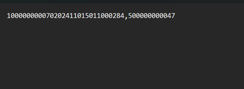

- Html
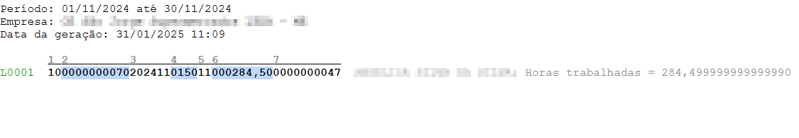
- Html Tabela
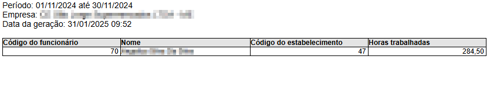

## Ajuste gravação afastamentos [#139](https://github.com/simixsistemas/Simix.Ponto.Calc/pull/139)

## Mesclar (ajustes) ♻ [#138](https://github.com/simixsistemas/Simix.Ponto.Calc/pull/138)

### Objetivo

Fix: [#169](https://github.com/simixsistemas/Simix.Ponto.Cloud/issues/169)

### Alterações
- Realizamos ajustes no método mesclar para que seja executado corretamente.

### Demonstração

## Ajustes PontoCalcRegrasPremio [#137](https://github.com/simixsistemas/Simix.Ponto.Calc/pull/137)

## Ajustes FolhaPagExp e testes. [#136](https://github.com/simixsistemas/Simix.Ponto.Calc/pull/136)

### Objetivo

Fix: [#126](https://github.com/simixsistemas/Simix.Ponto.Calc/issues/126)

### PR's Referências
- [Ajustes e Exportação da folha.♻](https://github.com/simixsistemas/Simix.Ponto.Cloud/pull/184)

### Alterações
- Ajustes de formatação de querys.
- 
- 
✨ 🐛 ♻

## Atualização cálculos PontoCalcPonto [#135](https://github.com/simixsistemas/Simix.Ponto.Calc/pull/135)

### Objetivo
Fix:#123

### Alterações

- Teste e ajustes do calcular da PontoCalcPonto.

## Migração Mesclar ✨ [#134](https://github.com/simixsistemas/Simix.Ponto.Calc/pull/134)

### Objetivo

Fix: [#169](https://github.com/simixsistemas/Simix.Ponto.Cloud/issues/169)

### Alterações
- Realizamos a migração do método Mesclarar da PontoCalcDia.

### Demonstração

## Gravação PontoCalcDia [#132](https://github.com/simixsistemas/Simix.Ponto.Calc/pull/132)

### Objetivo
Fix:#123

### Alterações

- Teste registro e gravação PontoCalcDia com rotina manutenção e importação

### Demonstração
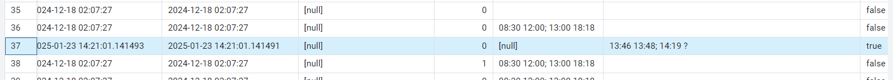

## Salvar totais (CalcularDados) ✨ [#131](https://github.com/simixsistemas/Simix.Ponto.Calc/pull/131)

### Objetivo

Ticket: [#160](https://github.com/simixsistemas/Simix.Ponto.Cloud/issues/160)

### Alterações

- Passado a CalcularDados para dentro do PontoCalc
- Tratamento de alguns nos campos
- Removido a PontoCalcLinTot e deixado a PontoCalcTot

## Finalizar a classe FolhaPagExp.✨ [#130](https://github.com/simixsistemas/Simix.Ponto.Calc/pull/130)

### Objetivo

Fix: [#126](https://github.com/simixsistemas/Simix.Ponto.Calc/issues/126)

### Alterações
- Realizado a migração da **FolhaPagExp**.
- Ajustado as funções conforme a necessidade.
- Criado teste **FolhaPagExpTeste**.
- Deixado comentado algumas funções de exportação pois será realizado na nuvem.
- Realizar o teste de Exportar.**(Pendente)**

## Gravação PontoCalc (continuação) [#129](https://github.com/simixsistemas/Simix.Ponto.Calc/pull/129)

## Teste PontoRegistro [#125](https://github.com/simixsistemas/Simix.Ponto.Calc/pull/125)

### Objetivo
Fix:#123

### Alterações

- Teste de registro no banco de dados Postgresql

### Demonstração

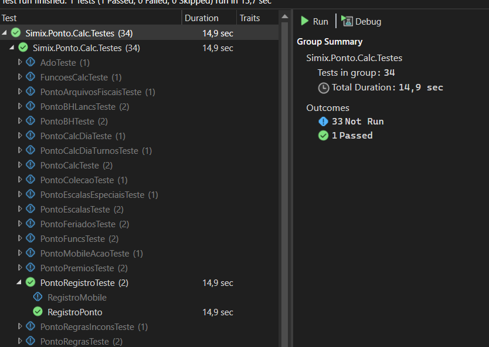

## Ajustes gerais para integração com o Cloud ♻ [#121](https://github.com/simixsistemas/Simix.Ponto.Calc/pull/121)

### Objetivo

Fix: https://github.com/simixsistemas/Simix.Ponto.Calc/issues/120

### Alterações

- Ajustes gerais para carregar coleções do banco
- Configuração do AutoMapper
- Novas extensões para Data e String
- Atualização das Libs
- Ajustes gerias nas coleções
- Ajustes de algumas funções de datas: b_DataIniFim2AnoMes, b_IntervaloMes e b_DiaInicioCartao
- Propriedade ConnectionString para ser setada do Cloud

## Finalização da classe PontoMobileAcao ✨ [#119](https://github.com/simixsistemas/Simix.Ponto.Calc/pull/119)

### Objetivo

Fix:#115

### Alterações

- Finalização da classe PontoMobileAcao.

## Ajustes gerais de testes ♻ [#117](https://github.com/simixsistemas/Simix.Ponto.Calc/pull/117)

### Objetivo

Fix: https://github.com/simixsistemas/Simix.Ponto.Calc/issues/118

### Alterações

- Ajuste da função AdicionarAnoMes
- Ajustes gerais nos testes
- Correção de acentuação
- Criados método Simular para chamar no Cloud

## Comando Exportar ✨ [#116](https://github.com/simixsistemas/Simix.Ponto.Calc/pull/116)

### Objetivo

Fix: #84

### Alterações

- Exportação de valores da PontoCalc.

## Migração classes Calcular do Serviço. ✨ [#114](https://github.com/simixsistemas/Simix.Ponto.Calc/pull/114)

### Objetivo

Fix: [#76](https://github.com/simixsistemas/Simix.Ponto.Calc/issues/76)

### Alterações
- Realizada a migração das classes calcular **CalcularBH, CalcularDados e CalcularParcial**.
- Realizado a migração de algumas funções e classes dependentes.

## Ajustes gerais de migração ♻ [#113](https://github.com/simixsistemas/Simix.Ponto.Calc/pull/113)

### Objetivo

Fix: [#111](https://github.com/simixsistemas/Simix.Ponto.Calc/issues/111)

### Alterações
- Realizamos os ajustes necessários para que o projeto seja compilado sem apresentar erros. 

### Demonstração
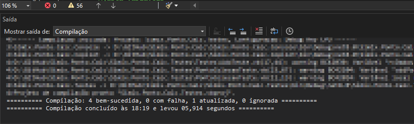

## Migração PontoAfastas e PontoCalcs. ✨ [#112](https://github.com/simixsistemas/Simix.Ponto.Calc/pull/112)

### Objetivo

Fix: [#110](https://github.com/simixsistemas/Simix.Ponto.Calc/issues/110)

### Alterações
- Realizado a migração das classes **PontoAfastas** e **PontoCalcs**.
- Deixado algumas funções comentadas com **'TODO:Migrar**, por depender de forms e classes obsoletas.

## Classes faltantes ✨ [#109](https://github.com/simixsistemas/Simix.Ponto.Calc/pull/109)

### Objetivo

Fix: [#106](https://github.com/simixsistemas/Simix.Ponto.Calc/issues/106)

### Alterações
- Realizamos a migração das classes: PontoCalcCampoCustom, PontoCalcCamposCustom, PontoBHsFuncs e PontoQHorarioLayout respeitando seus métodos e propriedades. 

## Finalização das classes dos arquivos fiscais. ✨ [#107](https://github.com/simixsistemas/Simix.Ponto.Calc/pull/107)

### Objetivo

Fix: [#103](https://github.com/simixsistemas/Simix.Ponto.Calc/issues/103)

### Alterações
- Descomentado as funções que tinha **'TODO:Migrar**
- Ajustado os erros das classes.

## Ajustes gerais PontoCalc ♻ [#104](https://github.com/simixsistemas/Simix.Ponto.Calc/pull/104)

### Objetivo

Continuação do PR https://github.com/simixsistemas/Simix.Ponto.Calc/pull/89

### Alterações

- Ajustes de acentuação
- Ajustes dos enums
- Ajustes gerais de métodos faltantes

## Classes PontoQHorario-PontoQHorarios [#102](https://github.com/simixsistemas/Simix.Ponto.Calc/pull/102)

### Objetivo

Ticket: [#x](https://simix.movidesk.com/Ticket/Edit/x)

### Alterações

- Classes da família PontoQHorario e PontoQHorarios. 

## Migração da PontoBH*. ✨ [#101](https://github.com/simixsistemas/Simix.Ponto.Calc/pull/101)

### Objetivo

Fix: [#90](https://github.com/simixsistemas/Simix.Ponto.Calc/issues/90)

### PR's Relacionados
- [Migração da PontoCalc* ✨](https://github.com/simixsistemas/Simix.Ponto.Calc/pull/89)
- [Migração da PontoCalcDia* ✨](https://github.com/simixsistemas/Simix.Ponto.Calc/pull/85)
- Migração da PontoQHorario*...

### Alterações
**Algumas funções que usam chamadas de classes que possuem PR's em aberto, descomentadas para quando for feito o Marged ajustares corretamente**.

- Migração da classe **PontoBH**.
- Migração da classe **PontoBHs**
- Migração da classe **PontoBHCalc**.
- Migração da classe **PontoBHCalcs**.
- Modificação da classe **PontoBHConfig**.
- Modificação da classe **PontoBHLanc**.
- Modificação da classe **PontoBHLancs**.
- Modificação da classe **PontoBHMes**.
- Modificação da classe **PontoBHMeses**.
- Modificação da classe **ADODBRecordset**.
- Modificação da classe **mdPontoCalc**.
- Modificação da classe **PontoBHExtras**.
- Criação da **PontoBHTeste**.

## Classes premio ✨ [#100](https://github.com/simixsistemas/Simix.Ponto.Calc/pull/100)

### Objetivo

Fix: [#99](https://github.com/simixsistemas/Simix.Ponto.Calc/issues/99)

### Alterações
- Realizamos a migração das classes:
PontoRegraPremio
PontoRegraPremioDia
PontoRegrasPremio
PontoRegrasPremioDia
PontoCalcRegraPremio
PontoCalcRegrasPremio
PontoRegrasTeste

### Demonstração

## Criação de testes unitários ✨ [#98](https://github.com/simixsistemas/Simix.Ponto.Calc/pull/98)

### Objetivo

Fix: [#68](https://github.com/simixsistemas/Simix.Ponto.Calc/issues/68)

### Alterações
- Realizamos a criação das classes:
PontoFeriadosTeste
PontoPremiosTeste
PontoSituacoesTeste
PontoTurnosEspTeste
PontoEscalasTeste
PontoTabCampoCustomTeste
PontoBHLancsTeste

### Demonstração

## Migração da PontoRegraIncons*.✨ [#97](https://github.com/simixsistemas/Simix.Ponto.Calc/pull/97)

### Objetivo

Ticket: [#87](https://github.com/simixsistemas/Simix.Ponto.Calc/issues/87)

### Alterações
- Realizada a migração das classes **PontoRegraIncons** e **PontoRegrasIncons**.
- Realizado a criação dos testes **PontoRegrasInconsTeste**.

## main -> dev (temp) [#93](https://github.com/simixsistemas/Simix.Ponto.Calc/pull/93)

## Migração da PontoFunc* ✨ [#92](https://github.com/simixsistemas/Simix.Ponto.Calc/pull/92)

### Objetivo
Fix: [#72](https://github.com/simixsistemas/Simix.Ponto.Calc/issues/72)

### Alterações

- Realizamos a finalização da **PontoFunc** e da **PontoFuncs**.
- Adicionado funções pendentes na **PontoTabCamposCustom** e **mdPontoCalc**.
- Criado a **PontoFuncsTeste**.

## Migração da PontoCalc* ✨ [#89](https://github.com/simixsistemas/Simix.Ponto.Calc/pull/89)

### Objetivo

Fix: #71 

### Alterações
- Migração da classe PontoCalc
- Migração da classe PontoCalcPonto
- Ajuste dos merges/conflitos
- Ajustes das classes relacionada

## Migração da PontoCalcDia* ✨ [#85](https://github.com/simixsistemas/Simix.Ponto.Calc/pull/85)

### Objetivo

Fix: #86 

### Alterações

- Migração da classe do Dia
- Migração da classe dos Turnos
- Migração das classes relacionadas (Copia, Campos custom)
- Criação dos testes

