# 02/09/2026

## Melhorias na Sincronização

- Corrigido o erro de *Connection timed out* na sincronização com equipamentos que usam HTTPS: o sistema agora detecta o protocolo correto antes de se comunicar.
- O erro em um coletor não interrompe mais a sincronização dos demais coletores da empresa; a falha fica registrada no próprio coletor e a varredura continua.
- Situação do coletor mais detalhada, diferenciando erro de conexão e erro de dados, com registro dos logs de sincronização.
- Novo monitor interno para a equipe Símix acompanhar a situação dos coletores de todos os clientes e agir de forma proativa.
- Diversos ajustes gerais na sincronização e no agente.

## Histórico de geração de Espelhos e Folha ✨

As gerações do Espelho Ponto e da exportação da Folha de Pagamento agora ficam registradas, com consulta de quem gerou e acesso aos arquivos.

- **Espelho Ponto**: novo submenu **Histórico** em cada card, com as gerações realizadas, o responsável e os links dos arquivos.
- **Exportação da Folha**: novo ícone de **Histórico** ao lado do título, permitindo consultar gerações anteriores e recarregar uma sessão específica.
- Ajustes na geração do Espelho Ponto durante a exportação da folha.

- Histórico do Espelho:
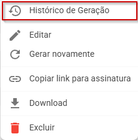
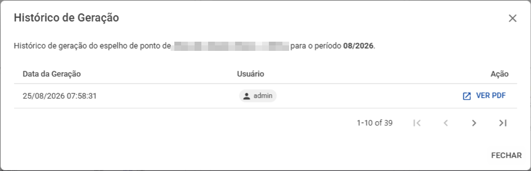

- Histórico da Folha:
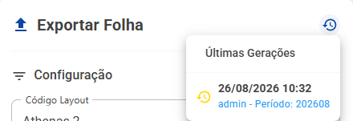

- Geração da folha:
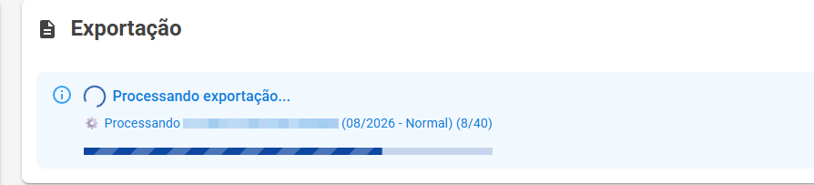

## Banco de horas e afastamentos ✨

- Nova opção de tipo **Banco de horas** no cadastro de afastamentos: as horas do afastamento passam a compor o saldo do banco de horas do colaborador.
- O saldo do afastamento do tipo BH entra no cálculo do saldo atual do banco de horas, com o desconto/acréscimo aplicado corretamente e o saldo atual calculado somente até o período selecionado.
- Novo campo de **horas de saldo de BH (atual)** nos totais da manutenção.
- Nas faltas sem compensação, o afastamento separado passa a ser ignorado.

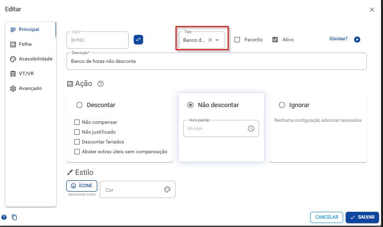

- Saldo do afastamento tipo BH compondo o banco de horas:

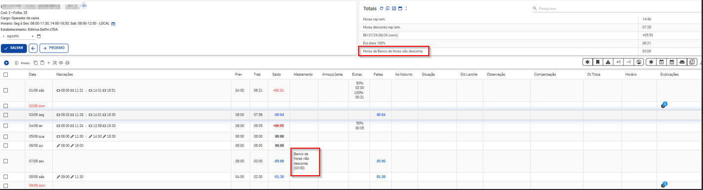

- Saldo de BH (atual) nos totais da manutenção:

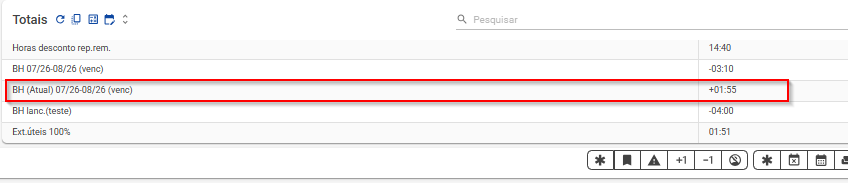
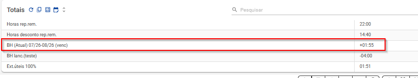

## Pendências com seleção de turno (layout Livre/Motoristas) ✨

Para empresas com layout do tipo **Livre ou Motoristas**, as pendências de ponto agora solicitam o tipo do turno do colaborador.

- Ao criar a solicitação, o turno é informado e aplicado corretamente após a aprovação.
- Ajustes também na importação de registros de motoristas.

- Antes da solicitação:
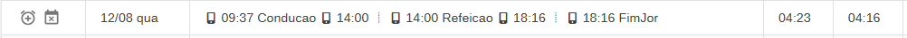
- Solicitação com turno:
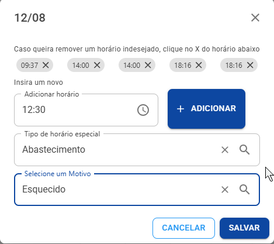
- Após a aprovação:
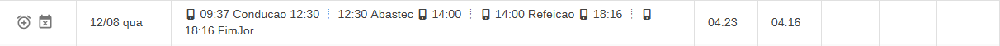
- Testado em layout comum:
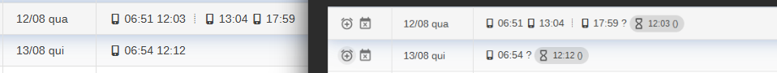
- Teste do cálculo:
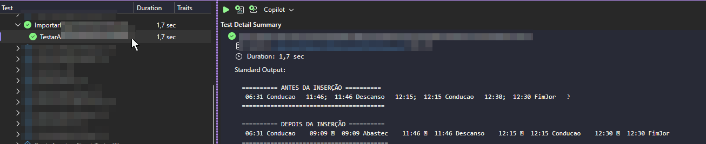

## Dois contratos — validação mais completa

Melhorias no tratamento de colaboradores com dois contratos no mesmo dia.

- Registros que excedem as horas previstas de um contrato são direcionados automaticamente para o contrato que possui as horas previstas, gerando as horas extras corretamente.
- Validação mais robusta dos horários realizados fora das previstas do quadro de horários.
- Tratamento correto dos dois contratos também ao **reimportar** os registros.

## Coletores/AFD

- Novos filtros por **estabelecimento, grupo de estabelecimentos e estabelecimentos relacionados** ao enviar colaboradores para os coletores.
- Coletor sem estabelecimento no cadastro passa a receber todos os colaboradores, mesmo com as opções de filtro marcadas nas configurações.

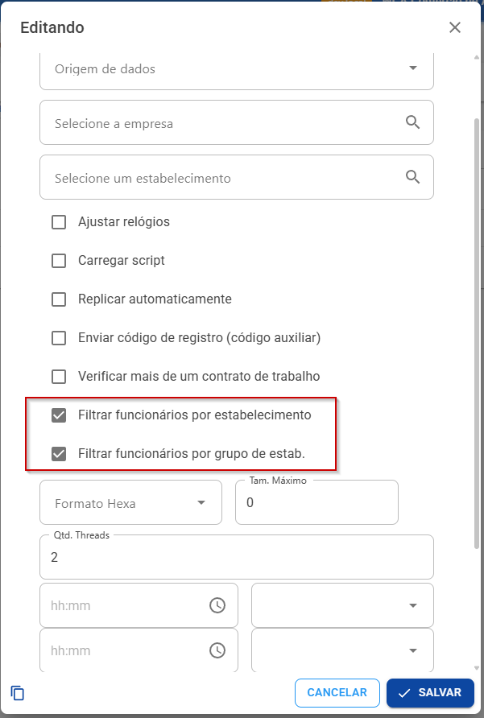
- **Detecção automática do layout do AFD** (Portaria 671 ou 1.510): não é mais necessário escolher o modelo do arquivo manualmente.

- Importação do TXT no novo layout:

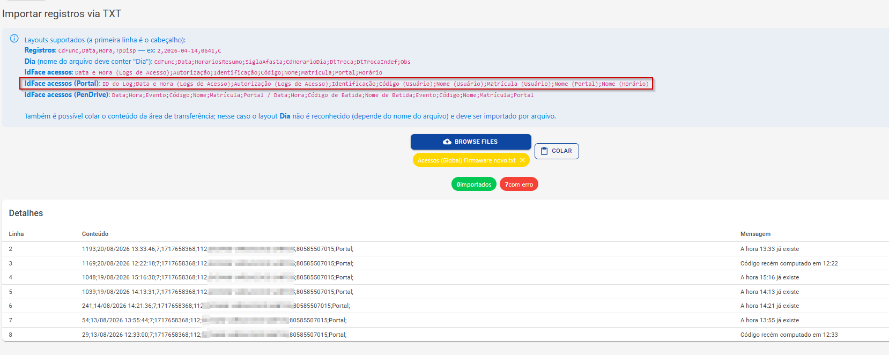

## Espelho Ponto e Folha de Pagamento

- **Download de todos os espelhos**: novo filtro por grupo de estabelecimentos e botão para **cancelar** o download.
- O **e-mail da contabilidade** na folha agora pode ser editado, apagado ou restaurado para o padrão.
- Nova **API de integração** para consulta dos espelhos de ponto, retornando o código, o nome do colaborador e o link do PDF — com os mesmos filtros da tela (período, colaborador, situação, estabelecimento etc.).
- A exportação da folha não gera novamente os espelhos, agilizando o fechamento.
- A assinatura do Espelho Ponto passou a ser armazenada de forma otimizada, mantendo a compatibilidade com as assinaturas existentes.

- Download:

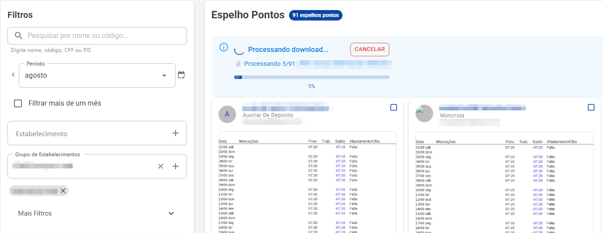

- Cancelar:

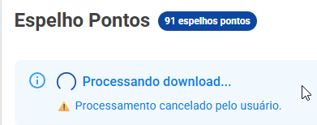

- Espelho Ponto (assinatura):

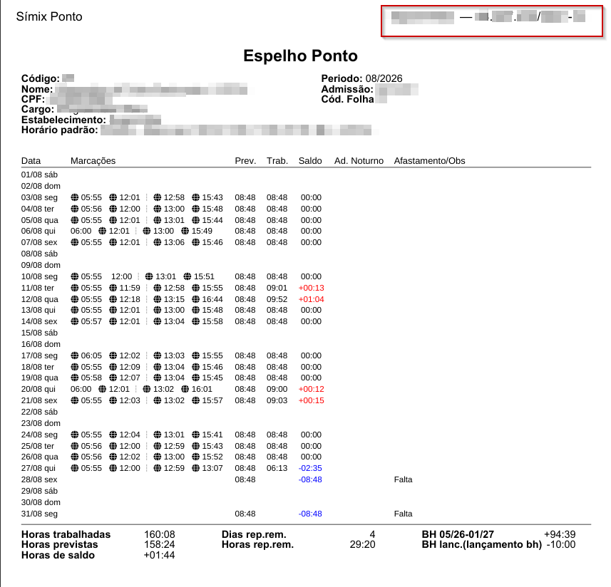

## Manutenção em lote

- Novos filtros de **Departamento, Setor e Seção**.
- Maior segurança: será exibido alerta caso não selecionado filtro ou for aplicado a muitos colaborados

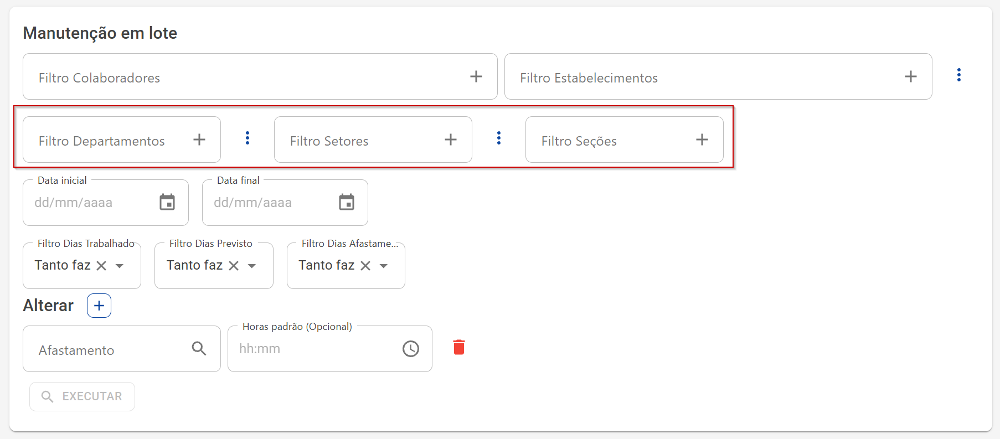

## Relatórios e dashboards

- Novo widget de **Absenteísmo por dia**: filtre um período e veja o absenteísmo, as horas de faltas e as horas previstas dos colaboradores.
- Mais opções na visão de BI de turnover por departamento, conforme solicitações de clientes.
- Nova opção de Expressão nos campos, para consultas avançadas (por exemplo, percentual com agrupamento)

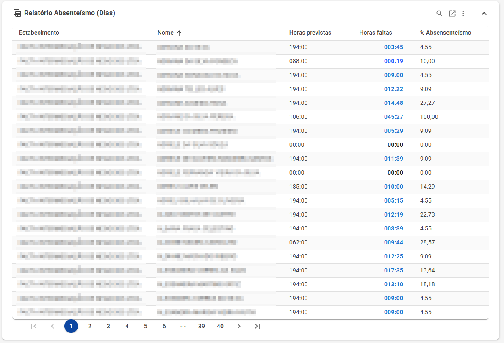

## Melhorias de interface

- **Filtro global**: as páginas agora avisam quando nenhum dado é encontrado por causa do filtro global, e o ícone indica visualmente quando há filtros aplicados.
- **Importação AFD**: exibição do progresso, execução de múltiplas importações em abas diferentes e botão para cancelar.
- Campos de documento aceitam colar números com caracteres especiais, que são removidos automaticamente.
- Os chips dos campos de pesquisa ficaram clicáveis, levando direto ao cadastro do item.
- Períodos de meses informados em ordem invertida são corrigidos automaticamente.

- Aviso de filtro global sem resultados:
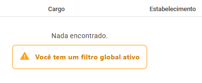

- Filtro global desativado:

- Filtro global ativo:

## Desempenho e infraestrutura

- **Fotos e arquivos mais rápidos**: armazenamento migrado para o Brasil, com links diretos e cache configurado.
- Otimizações gerais de desempenho: consultas mais eficientes, cache e paralelismo em pontos críticos e novos índices no banco.
- **Processamento facial** mais eficiente, priorizando os registros com foto vinculada, com exibição da mensagem de erro na tela de consultas.
- Atualização dos bancos dos clientes mais rápida.
- Nova tela interna de **Features** para a equipe Símix habilitar recursos e modos de funcionamento por cliente.
- Verificações automáticas de saúde do sistema após cada atualização e ampliação da cobertura de testes automatizados em todos os projetos.
- Conclusão da unificação da importação de registros, padronizando o processamento vindo de coletores, arquivos e importações.

- Consulta facial:
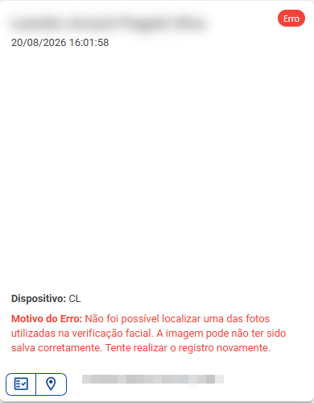

- Verificação de saúde do sistema:
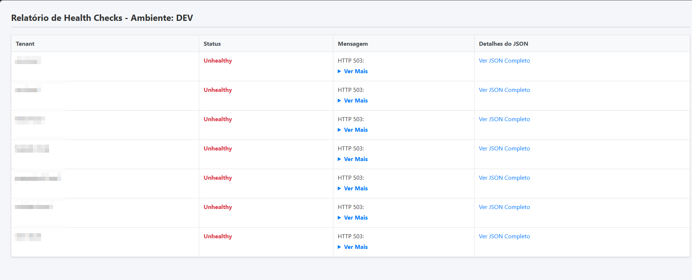

## Outras melhorias e ajustes

- **VTs e VRs**: corrigida a duplicação de valores ao clicar mais de uma vez em salvar e o erro ao calcular quantidade total igual a zero.
- **Pendências**: ao alterar o estabelecimento/departamento/setor do colaborador, as pendências do período são atualizadas automaticamente — somente as ainda pendentes; o histórico das aprovadas e reprovadas é mantido.
- **Regras de inconsistência**: correção na verificação quando utilizada a opção de validar horas de intervalo.
- **Regras de prêmio**: correção na verificação do total de manutenções com parâmetro.
- Revisão dos cálculos para desconsiderar dados já excluídos.
- Ajustada a página Espelho Ponto para utilizar a permissão correta.
- Correções de estabilidade nos dashboards.