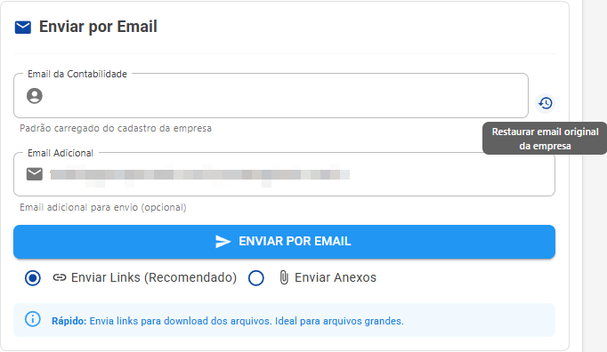
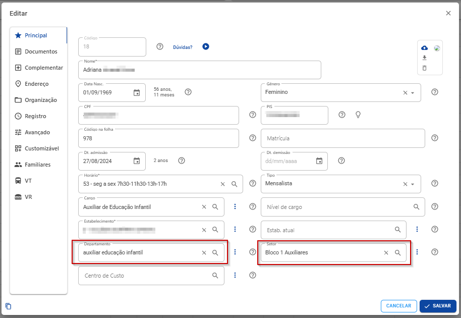
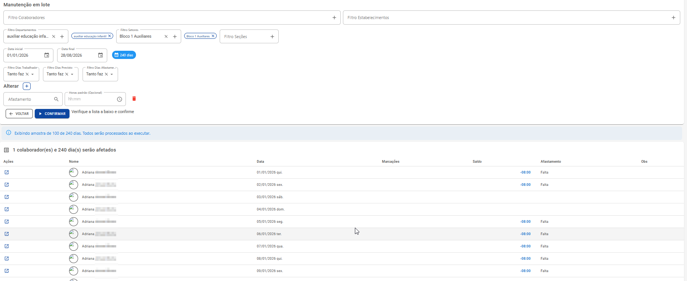
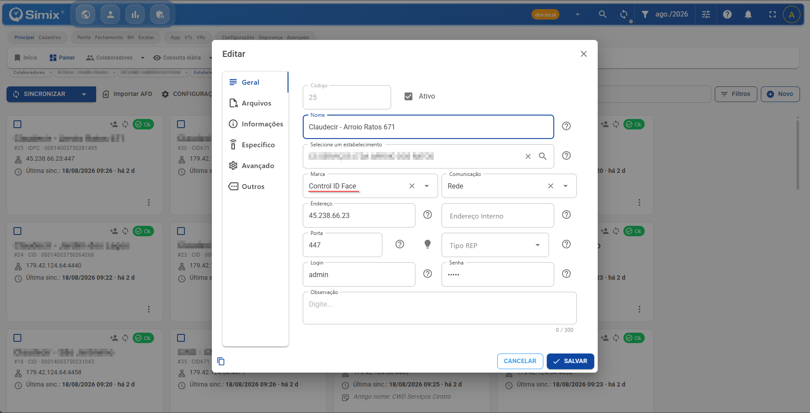
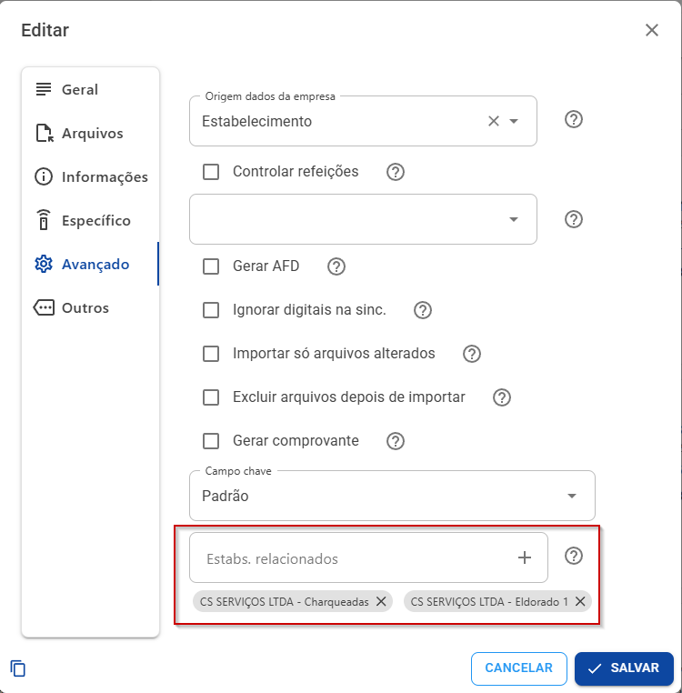
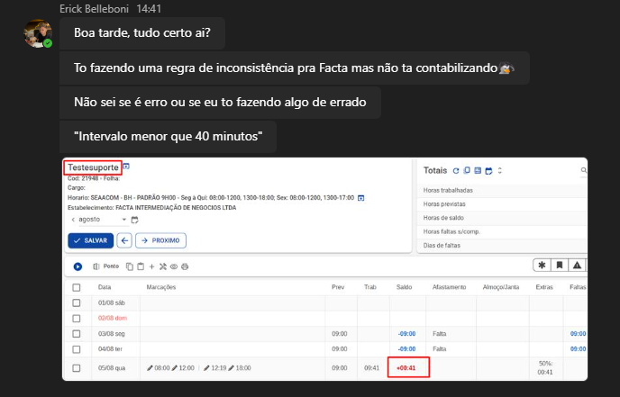
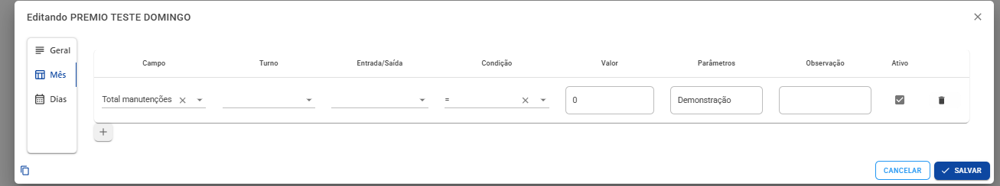
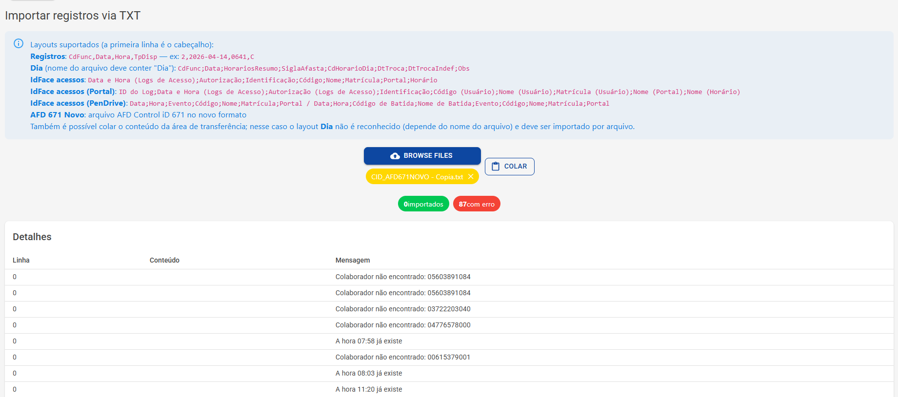
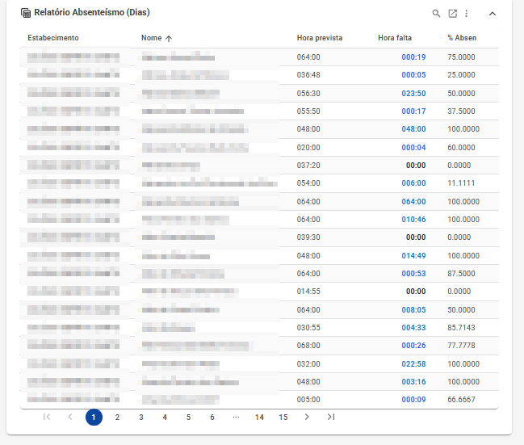

# Atualizacao - Sem_Iteracao 🎉

### **Esta atualizacao atende a tickets de clientes**

# Documentacao 📝

## Monitor de coletores no admin e situação por enum [#2443](https://github.com/simixsistemas/Simix.Ponto.Cloud/pull/2443)

### Resumo

- **ColetoresInfo**: nova tabela host-only que espelha o status de sincronização dos coletores de todos os tenants, atualizada de forma best-effort a cada `SalvarStatus` (`ColetoresInfoManager`, com `CurrentTenant.Change(null)`). Guarda TenantName, EnderecoAtual, LocalSinc e ObsInterna (anotação do suporte — nunca sobrescrita pela sincronização).
- **Situação por enum**: `ColOk` (bool) substituído por `Situacao` (`ColetorSituacaoTipo`: Desconhecido=0, Ok=1, Erro=-1, ErroConexao=-2, ErroDados=-3) em `Coletores` e `ColetoresInfos`. Exceção de comunicação → ErroConexao; importação com erros de dados → ErroDados; falha genérica → Erro.
- **Monitor `/admin/coletores`** (`ColetoresMonitor.razor`, entrada no NavAdmin só p/ host): contadores clicáveis por situação, busca, auto-refresh 60s, link para o site do tenant, diálogo de logs de sincronização (lidos no banco do tenant dono do coletor) e edição de obs interna. Protegido por `Dashboard.Host`.

### Banco

- Migrations: `ColetoresInfos` + `ColetorSituacao` (host e tenant, com backfill `ColOk`→`Situacao`) + `ColetoresInfoCamposMonitor` (host).
- Script idempotente `SQLs/Ajustes/20260902_Coletores.Situacao.sql` cobre bancos que não recebem migrations.
- Rodar o DbMigrator após o merge.

### Atenção

- Contrato REST mudou: `ColetorDto.ColOk` → `Situacao` (numérico). Consumidores externos que leem `ColOk` precisam acompanhar.

### Testes

- 173/173 testes de domínio (8 novos p/ `ColetoresInfoManager`: upsert, preservação de ObsInterna/último sucesso, falha best-effort, logs cross-tenant).
- Validado no app real (Development local) via Playwright: login host, painel, link do tenant, diálogo de logs e edição de obs.

🤖 Generated with [Claude Code](https://claude.com/claude-code)

## Tratamento de erros na sincronização de coletores [#2441](https://github.com/simixsistemas/Simix.Ponto.Cloud/pull/2441)

### Problema

Na varredura de coletores do worker, a exceção de UM coletor abortava a sincronização de TODOS os demais do tenant. Visto em produção hoje (logs do worker):

- `NullReferenceException` no resumo quando o coletor retorna **zero registros** (`primeiro`/`ultimo` nulos) — tenants mercamax e ssm
- `ComponentNotRegisteredException` para marca sem keyed service (ex.: **ZPM**) — tenant device

Além disso, `SalvarMensagensLog` usava `autoSave: false`: nas chamadas diretas de componente/diálogo (sem UnitOfWork ambiente) os logs SINC se perdiam silenciosamente — nenhum ColetoresLog das falhas foi encontrado em banco algum durante o diagnóstico.

### Correção

- **Try/catch por coletor** no loop de `ReceberRegistros(List)`: o erro vira `ErrosDetalhados` + status/log do próprio coletor e a varredura segue para o próximo
- Guarda de nulo no resumo com zero registros
- Marca não registrada vira mensagem amigável (`GetKeyedService` + throw claro)
- `SalvarMensagensLog` com `autoSave: true`

Complementa o PR da DLL Integracoes ([simixsistemas/Simix.Ponto.Integracoes#25](https://github.com/simixsistemas/Simix.Ponto.Integracoes/pull/25) — sonda TLS que corrige o "Connection timed out" dos REPs HTTPS no worker), mas é independente dele.

### Testes

- `Simix.Ponto.Domain.Tests`: **165/165** aprovados
- Domain e Application compilam sem erros

🤖 Generated with [Claude Code](https://claude.com/claude-code)

## Ajustes na manutenção de VTs e VRs. [#2437](https://github.com/simixsistemas/Simix.Ponto.Cloud/pull/2437)

### Objetivo
https://github.com/simixsistemas/Simix.Ponto.Cloud/issues/2384

### Alterações
- Ajuste ao salvar quantidades manual para não duplicar soma ao clicar mais de uma vez no salvar.
- Ajuste de erro ao calcular quantidade total = 0

## Importação de imagem com IA no ETL ✨ [#2429](https://github.com/simixsistemas/Simix.Ponto.Cloud/pull/2429)

Novo tipo de importação no módulo ETL: **foto de folha ponto/planilha manuscrita** (`.jpg/.jpeg/.png`). Uma IA de visão (Azure OpenAI, deployment configurado em `OpenAI:VisionModel`, registrado no Kernel com serviceId `etl-vision`) extrai as linhas conforme os campos do layout e gera um CSV intermediário que segue o pipeline normal da DevShare.Etl — regras, mesclagem, preview, tarefa e log funcionam sem mudança; a DLL não conhece imagem.

### Fase 1 — extração por IA

- `EtlImagemExtracaoService` (Domain): extração com structured JSON + **sugestão de campos por imagem** na aba Arquivo & Preview
- **Cache da extração no blob** (`etl_{id}.{hash}.extracao.json`): análise e execução usam o MESMO resultado (IA não é determinística) e a chamada de visão não é paga duas vezes; o hash dos campos invalida o cache quando o layout muda
- Robustez (review adversarial, 16 defeitos corrigidos): leitura tolerante do JSON (número sem aspas/linha nula), sanitização de `"`/`;`/quebras p/ o ChoCSVReader, normalização de vírgula decimal pt-BR (evita "8,5"→85), linhas ilegíveis descartadas com aviso, detecção de resposta truncada, validação de magic bytes/19MB, `MaxRecords` limita a extração, instrução anti-prompt-injection
- Modelo recomendado: `gpt-5-mini` (melhor acurácia em formulários manuscritos nos benchmarks 2026; ~US$ 0,002-0,005/folha)

### Fase 2 — folha → registros de ponto

- `EtlPontoAnaliseService` (Domain): interpreta o resultado **completo** da execução como marcações — detecção de campos por convenção (NOME/MATRICULA/CPF/DATA + colunas com valores HH:mm) e **matching com o cadastro**: matrícula → CPF → nome normalizado exato → aproximado; demitidos incluídos (folha retroativa) e matrícula/CPF/nome duplicados viram **Ambíguo** para decisão humana
- **Conferência** na própria página `/etl/executar` (`EtlPontoConferencia`): período de referência yyyyMM (validado, com virada de ano dez↔jan), correção de ambíguos, linhas desmarcáveis, monitor próprio (chave `etl-ponto`) com reanexo ao reabrir a página e limpeza de tarefa órfã se o enfileiramento falhar
- `TarefaEtlPonto`: cria `Registro` **Pendente** por marcação (TpDisp `I`, DispositivoNome "ETL folha (foto)") e enfileira o processamento unitário padrão — **fluxo unificado** (`RegistrosService`); duplicado já importado é ignorado e existente não importado é reprocessado direto (o job de pendentes ignoraria não-pendentes)
- Rastreabilidade: origem no registro + vínculo com a foto pelo `EtlExecucaoLog` (mesmo `ArquivoId`)

### ⚠️ Pendência de infra

Criar o deployment **`gpt-5-mini`** no recurso Azure OpenAI `simixponto-openai` (mesmo endpoint/chave). Sem ele, upload de imagem falha com mensagem amigável e o restante do ETL segue normal.

### Testes

50 testes do ETL (166/166 na suíte do Domain): extração fake de ponta a ponta (vírgula decimal, aspas, linha nula/vazia, cache entre análise e execução, imagem inválida, IA não configurada) + análise de ponto (detecção de campos, matching exato/aproximado/ambíguo, matrícula duplicada, datas com virada de ano, período inválido, horários).

Design: `docs/superpowers/specs/2026-08-31-etl-imagem-ia-design.md`.

🤖 Generated with [Claude Code](https://claude.com/claude-code)


## Ajustes melhorias.♻ [#2427](https://github.com/simixsistemas/Simix.Ponto.Cloud/pull/2427)

### Objetivo

Fix: [#2405](https://github.com/simixsistemas/Simix.Ponto.Cloud/issues/2405)
Fix2: [#2409](https://github.com/simixsistemas/Simix.Ponto.Cloud/issues/2409)

### Alterações
- Ajustada a execução da seed para criar login dos funcionários somente durante a migração.
- Ajustes na tarefa `Processar Facial`:
  - Priorizada a busca e processamento dos registros que possuem `FotoLink`.
  - Otimização para busca de funcionarios
  - Após o processamento, são executados os registros sem `FotoLink`, utilizando o link legado.
  - Adicionado tratamento na tela de consultas para exibir a mensagem de erro ao usuário.
- Ajustado o teste `Novo_Afastamento` para excluir o afastamento logo após sua criação.
- Ajustado o campo de e-mail da contabilidade na folha, permitindo editar, apagar ou restaurar o e-mail padrão.
- Ajustado o armazenamento da assinatura do `Espelho Ponto` para utilizar o Blob em vez do banco, mantendo o carregamento atual para `Base64` e link do Blob, garantindo retrocompatibilidade.

### Demonstração
- Email contabilidade.


- Consulta facial


- Espelho Ponto.


## Melhorias Agente e Status [#2417](https://github.com/simixsistemas/Simix.Ponto.Cloud/pull/2417)


## Ajustes Deploy ♻ [#2416](https://github.com/simixsistemas/Simix.Ponto.Cloud/pull/2416)


## Ignorar afastamento separado nas faltas sem compensação ✨ [#2415](https://github.com/simixsistemas/Simix.Ponto.Cloud/pull/2415)


## Novo módulo de integrações/ETL ✨ [#2414](https://github.com/simixsistemas/Simix.Ponto.Cloud/pull/2414)

Novo módulo de integrações/ETL construído sobre a biblioteca **DevShare.Etl.Core** (parse de csv/txt via ChoETL e xlsx/xls via ClosedXML, com regras de validação e mesclagem de duplicados).

### O que entra

- **Entidade `EtlLayout`** (Nome, Descricao, Ativo, Json, IconeNome, Ordem): cadastro dos layouts com a configuração completa da DevShare.Etl serializada em `Json` (job → `EtlLayoutImport` → `ImportLayout` → `LayoutField` com bindings, transformações, regras e condições)
- **Painel `/etl/painel`**: cards dos layouts com pesquisa/filtro; upload direto no card abre a página de execução com o arquivo carregado
- **Cadastro `/etl/layout/{id}`**: todos os campos e recursos da DevShare.Etl — opções de execução, importações (separador, cabeçalho, linha de dados, codificação, formato), grade de campos com diálogo completo (tipo, chave, estratégia de duplicados, origens/bindings, funções de transformação com catálogo, regras e condições). Na aba *Arquivo & Preview*: upload de exemplo, **sugestão automática de campos** (separador/cabeçalho/tipos inferidos por amostragem) e **pré-visualização** do processamento sem salvar
- **Execução `/etl/executar/{id}`** (`TarefaPageBase`): análise prévia, execução em background (`TarefaEtl`, Hangfire + monitor/SignalR) e resumo final com amostra dos registros e logs
- **`EtlExecucaoLog`**: histórico por execução (EtlLayoutId, ArquivoId, AnoMes, ArquivoNome, LayoutNome, `Situacao` + contagens), gravado pela tarefa; listagem via `GetExecucaoLogsAsync` (UI de histórico fica para um próximo PR)
- Permissões `Ponto.EtlLayouts` (Default/Create/Edit/Delete/Executar), menu **Módulos → Integrações → Painel ETL**, migrations `EtlLayouts` + `EtlExecucaoLogs` nos dois contextos
- Correção lateral: `MudFileUpload` do MudBlazor 9.3 usa `CustomContent` + `OpenFilePickerAsync` — corrigidas as 10 telas antigas que ainda usavam `ActivatorContent` e exibiam o botão default "Browse files"

### Notas técnicas

- O Blazor WASM **não** referencia a DLL (arrastaria DevShare.DataAccess com drivers de banco): DTOs espelho em `Application.Contracts/Etls/Config` + enums espelho em `Domain.Shared/Etls`; a Application serializa Config↔Json e o Domain deserializa o mesmo Json direto no modelo da DLL
- Upload no blob `ImpContainer` como `etl_{arquivoId}{ext}` (a extensão decide o parser); o processamento materializa o blob em arquivo temporário porque o `EtlService` lê de disco
- Referência à `DevShare.Etl.Core` no padrão Calc/Integracoes (Debug = ProjectReference; Release = NuGet `1.0.*`). ⚠️ O Release depende do pacote publicado **com o rename `EtlImport` → `EtlLayoutImport`** (já commitado na `dev` da DevShare.Etl)
- Fase de carga no ERP ainda não existe na DLL — a execução processa, valida e reporta (`SimulationMode`/`Connection` inertes)
- Testes: 17 novos em `Domain.Tests/Etls` rodando a DLL real (CSV/XLSX, regras, duplicados, sugestões, log de execução) — suíte completa 133/133

### Prints (simulação no demo-markus-local)

| | |
|---|---|
| **Painel**  | **Cadastro — Geral**  |
| **Sugestão de campos**  | **Campo — regras/condições**  |
| **Pré-visualização**  | **Execução — análise**  |
| **Execução — resultado** (soma na mesclagem + avisos da regra)  | |

🤖 Generated with [Claude Code](https://claude.com/claude-code)


## Ajustes gerais - Manutenção em lote ♻ [#2413](https://github.com/simixsistemas/Simix.Ponto.Cloud/pull/2413)

### Objetivo

Fix: [#2403](https://github.com/simixsistemas/Simix.Ponto.Cloud/issues/2403)

### Alterações
- Ajuste da manutenção em lote para utilizar o FuncionarioIds para realizar a filtragem dos colaboradores, deixando mais seguro a pesquisa.

### Demonstração




## Melhorias gerais. ♻ [#2411](https://github.com/simixsistemas/Simix.Ponto.Cloud/pull/2411)

### Objetivo

fix: [#2361](https://github.com/simixsistemas/Simix.Ponto.Cloud/issues/2361)

### Alterações
- Ajustes nos filtros globais:
  - Tratamento geral nas páginas para informar quando nenhum dado for encontrado devido ao filtro global.
  - Ícone dinâmico: exibido no formato `filled` quando houver filtros aplicados e `outline` quando não houver.
- Ajustes na Importação AFD:
  - Adicionado tratamento para exibição do progresso, permitindo executar múltiplas importações em abas diferentes.
  - Adicionado botão para cancelar a importação.

### Demonstração
- Sem dados.


- Filtro global desativado.


- Filtro global ativo.


## Ajuste enviar colaboradores para coletores ♻ [#2406](https://github.com/simixsistemas/Simix.Ponto.Cloud/pull/2406)

### Objetivo

Fix: [#2403](https://github.com/simixsistemas/Simix.Ponto.Cloud/issues/2403)

### Alterações
- Ajustado o envio dos colaboradores para o coletor, melhorado o filtro para caso mesmo esteja marcado as opções de filtro nas configurações do coletor mas não tiver estabelecimento no cadastro do coletor, envia todos os colaboradores independente do estabelecimento dele.


## Ajustes nos testes.♻ [#2402](https://github.com/simixsistemas/Simix.Ponto.Cloud/pull/2402)

### Objetivo

Fix: [#2379](https://github.com/simixsistemas/Simix.Ponto.Cloud/issues/2379)

### Alterações
- Adicionado delay de 30 segundos na execução do `Testar HealthChecks`.
- Corrigido o teste de UI do `Calcular Dados` para identificar corretamente a mensagem exibida na tela.

## Ajustes sincronização ♻ [#2399](https://github.com/simixsistemas/Simix.Ponto.Cloud/pull/2399)


## Ajustes pendências - Meta ♻ [#2396](https://github.com/simixsistemas/Simix.Ponto.Cloud/pull/2396)

### Objetivo
Fix: [#2395](https://github.com/simixsistemas/Simix.Ponto.Cloud/issues/2395)

### Alterações
- Realizado ajuste na atualização dos dados mensais do funcionário para também atualizar as pendências (PontoPend e AfastaPend) vinculadas ao período correspondente, quando houver alteração de estab/depa/setor.
>  As pendências são atualizadas somente quando estiverem com situação Pendente, mantendo o histórico das pendências já aprovadas ou reprovadas.

-  Adicionados novos métodos nos repositórios de PontoPend e AfastaPend para atualização em lote via EF Core (ExecuteUpdateAsync).


##  Histórico para geração dos Espelhos/Folha e ajustes.✨ [#2392](https://github.com/simixsistemas/Simix.Ponto.Cloud/pull/2392)

### Objetivo

Fix: [#2088](https://github.com/simixsistemas/Simix.Ponto.Cloud/issues/2088)

### Alterações
- Criado o histórico de geração de `Espelho Ponto` e `Folha de Pagamento`, registrando as gerações realizadas e o acesso aos links.
  - **Espelho Ponto:** adicionado o submenu `Histórico` em cada card, permitindo consultar as gerações, quem realizou a geração e acessar os links.
  - **Exportação da Folha:** adicionado o ícone de `Histórico` ao lado do título, permitindo visualizar as gerações e recarregar uma sessão específica.
- Ajustes na geração do `Espelho Ponto` durante a exportação da folha:
  - Retirada condição do calcular dados automático. Só respeitava o filtro da flag se estivesse com esse modo.
  - Ajustada a propagação do processo de geração.
- Gerado arquivos de migração e comandos SQL.

### Demonstração
- Histórico Espelho.


- Historico Folha


- Geração da folha.


## Otimizações para fotos/blob ♻ [#2389](https://github.com/simixsistemas/Simix.Ponto.Cloud/pull/2389)

### Objetivo

Implementar otimizações identificadas para os blobs/storage/upload/urls.

### Alterações

- Todos os blobs Azure migrados para o storage no Brasil, em vez de EUA
- Otimizações no upload para fotos
- Utilização de link direto (novo domínio para arquivos https://a.simixponto.app), sem precisa do FileController
- Configuração de cache para as fotos

## Otimizações para fechamento ♻ [#2388](https://github.com/simixsistemas/Simix.Ponto.Cloud/pull/2388)

### Objetivo

Ajustes/otimizações para fechamento.

### Alterações

- Não gera novamente os Espelhos na exportação da folha. Parece estar travando, investigar em nova issue

## Ajustes melhorias gerais.♻ [#2385](https://github.com/simixsistemas/Simix.Ponto.Cloud/pull/2385)

### Objetivo

Fix: [#2379](https://github.com/simixsistemas/Simix.Ponto.Cloud/issues/2379)

### Alterações
- Adicionado tratamento para evitar operações em componentes já descartados, no dashboard.
- Retirado alguns healthchecks, mantendo o `CheckHealthVPontoCalcDiaAsync` pois valida já as outra views e o `CheckHealthPontoCalcAsync`
- Ajustes nos bancos com erros:
  - Foram excluido bancos que não existiam mais.
  - `Demo-comercial` erros referente a falta de colunas na FuncionariosCC e FuncMesCC. Criado colunas manualmente.
  - MSG: [Ajuste delete](https://github.com/simixsistemas/Simix.Ponto.Calc/pull/468)

## Filtros manutenção em lote - Departamento, Setor e Seção ♻ [#2383](https://github.com/simixsistemas/Simix.Ponto.Cloud/pull/2383)

### Objetivo

Fix: [#2360](https://github.com/simixsistemas/Simix.Ponto.Cloud/issues/2360)

### Alterações
- Criado os filtros Departamento, Setor e Seção na tela de de Manutenção em lote.

### Demonstração


## Ajustes na sincronização ♻ [#2382](https://github.com/simixsistemas/Simix.Ponto.Cloud/pull/2382)


## Otimizações gerais ♻ [#2377](https://github.com/simixsistemas/Simix.Ponto.Cloud/pull/2377)

### Objetivo

Otimizações gerais.

### Alterações

- Índice para CPF/PIS
- Atualiza os status dos coletores por Set, em vez de Update
- Mais mensagem de progresso para os coletores

## Importar registros - Control ID 671 ♻ [#2372](https://github.com/simixsistemas/Simix.Ponto.Cloud/pull/2372)

### Objetivo

- Tratar importação registros Control ID 671

### Alterações
- Realizado o tratamento para importação dos registros utilizando a sincronização e a importação dos registros utilizando o AFD através da pagina **ImportarTXT**.

### Demonstração


## Ajustes na criação de banco - Migração ♻ [#2369](https://github.com/simixsistemas/Simix.Ponto.Cloud/pull/2369)

### Objetivo
Fix: [#2368](https://github.com/simixsistemas/Simix.Ponto.Cloud/issues/2368)

### Alterações
- Realizado ajuste de lógica e captura de erros
- Realizado ajustes de comandos SQL

## Ajustes gerais.♻ [#2367](https://github.com/simixsistemas/Simix.Ponto.Cloud/pull/2367)

### Objetivo

Fix: [#2365](https://github.com/simixsistemas/Simix.Ponto.Cloud/issues/2365)

### Alterações
- Ajustada a página `Espelho Ponto` para utilizar a permissão correta.
- Ajustadas as actions:
  - Migrada a execução dos testes da action `Deploy Worker (Beta)` para `Deploy (Beta)`.
  - Adicionado o parâmetro `github.repository` na execução das actions.
- Adicionado o parâmetro `DelaySegundos` ao script `TestarHealthChecks` para evitar a abertura simultânea de todas as conexões.

## Otimizações de performance ♻ [#2363](https://github.com/simixsistemas/Simix.Ponto.Cloud/pull/2363)

### Objetivo

Implementar melhorias depois da análise detalhe dos logs (txt e Application Insights) com o Claude Fable.

### Alterações

- Removido o LanguageManagement (fazia muitas chamas extras)
- Otimizações nas consultas do EF conforme indícios nos logs
- Utilizado cache e paralelismo em locais críticos (Permissões e Storage)
- Configuração do mínimo de threads

## Importar txt novo firmware IDFace / Ajuste VPontoCalcBITurnoverDepa♻ [#2362](https://github.com/simixsistemas/Simix.Ponto.Cloud/pull/2362)

### Objetivo

Fix: [#2355](https://github.com/simixsistemas/Simix.Ponto.Cloud/issues/2355)

### Alterações
- Implementado novo modelo de importação de arquivos na tela de Importar .TXT, para o novo layout do coletor Control IDFace.
- Ajustado a view VPontoCalcBITurnoverDepa, com mais opções solicitadas pelo cliente.

### Demonstração


## Ajustes gerais ♻ [#2357](https://github.com/simixsistemas/Simix.Ponto.Cloud/pull/2357)


## VPontoCalcDiaAbsenteismo ✨ [#2354](https://github.com/simixsistemas/Simix.Ponto.Cloud/pull/2354)

### Objetivo

- Widget de absenteísmo por dia para os colaboradores, para que seja possível filtrar um período e exibir o absenteísmo deste período filtrado.

### Alterações
- 

### Demonstração

## Ajustes actions healthchecks. [#2353](https://github.com/simixsistemas/Simix.Ponto.Cloud/pull/2353)

### Objetivo
Erro healthchecks.

### Alterações
- Tratamento de unitworker para cada healthcheck.
- Adicionado condição no script para cancelar a action caso algum banco apresente o status de Unhealthy
- Testes no local ok, executar no beta após o merge e validar.

## Melhorias gerais nos controles.♻ [#2351](https://github.com/simixsistemas/Simix.Ponto.Cloud/pull/2351)

### Objetivo

Fix: [#2343](https://github.com/simixsistemas/Simix.Ponto.Cloud/issues/2343)

### Alterações
- Ajustado o `SmxTextDoc` para permitir a colagem de números de documentos com caracteres especiais, removendo-os após a colagem.
- Ajustados os chips do `SmxLookup` para serem clicáveis e direcionarem para o cadastro do item.
- Ajustado o `SmxMonthRange` para corrigir automaticamente a ordem quando os meses forem informados de forma invertida.

## Coletores enviar colaboradores - Filtros estabelecimento/Estabelecimentos relacionados/Grupo de estabelecimentos ♻ [#2350](https://github.com/simixsistemas/Simix.Ponto.Cloud/pull/2350)

### Objetivo

Fix: [#2321](https://github.com/simixsistemas/Simix.Ponto.Cloud/issues/2321)

### Alterações
- Adicionado regras de filtro ao enviar colaboradores para os coletores utilizando estabelecimento, grupo de estabelecimento e estabelecimentos relacionados.
- Ajustado a nomenclatura do coletor Control ID Face

### Demonstração




## Ajustes testes HealthChecks.♻ [#2348](https://github.com/simixsistemas/Simix.Ponto.Cloud/pull/2348)

### Objetivo

Fix: [#Erro na Action HealthChecks](https://github.com/simixsistemas/Simix.Ponto.Cloud/actions/runs/32324098172)

### Alterações
- Adicionado tratamento de nomenclatura para execução do script no windows (local) e na action.
- Ajustes no check `UltimoRegistro`, para buscar os registros somente do tenant referente.

### Demonstração
- [Execução health checks](https://github.com/simixsistemas/Simix.Ponto.Cloud/actions/runs/32361452064)


## Pendencias - Motoristas ♻ [#2345](https://github.com/simixsistemas/Simix.Ponto.Cloud/pull/2345)

### Objetivo
Fix: [#2326](https://github.com/simixsistemas/Simix.Ponto.Cloud/issues/2326)

### PR Referência
[#465](https://github.com/simixsistemas/Simix.Ponto.Calc/pull/465)

### Alterações
- Realizado ajustes para solicitar o turno quando for tipo layout Livre ou Motoristas
- Realizado a criação de propriedades para receber o turno selecionado
- Realizado ajustes na chamada da calc, quando se tratando de registros com sigla.
- Realizado comando SQL.
- Atualizado comando SQL migração.
- Realizado arquivos de migração.

### Demonstração
- Antes da solicitação

- Solicitar

- Após aprovar

- Testado em layout comum


## Script/Action para testar HeathChecks.✨ [#2344](https://github.com/simixsistemas/Simix.Ponto.Cloud/pull/2344)

### Objetivo

Fix: [#2331](https://github.com/simixsistemas/Simix.Ponto.Cloud/issues/2331)

### Alterações
- Adicionados novos health checks: `VPontoCalcDia`, `VFuncMes` e `VFuncMesCad`.
- Adicionada a busca de tenants via API.
- Criado o script `TestarHealthChecks.ps1`, com o parâmetro `Ambiente` para definir `Oficial`, `Beta` ou `Dev`.
- Criada a action `Testar HealthChecks`.
- Ajustada a action de `Deploy (Beta)` para executar a action `Testar HealthChecks` ao finalizar o deploy.
✨ 🐛 ♻

### Demonstração


## Otimizações gerais ♻ [#2342](https://github.com/simixsistemas/Simix.Ponto.Cloud/pull/2342)

### Objetivo

Otimizações e melhorias identificados nos testes/logs.

### Alterações

- Criação de novos índices
- Otimizações do filtro para a FuncMes
- Configuração do módulo de Features do Abp (grupo Calc e Beta)
- Melhorias no cache do Status global
- Melhorias no layout do painel de coletores


## Otimizações na migração dos bancos ♻ [#2340](https://github.com/simixsistemas/Simix.Ponto.Cloud/pull/2340)

### Objetivo

Criar a migração inicial novamente só com os últimos comandos para agilizar a atualização dos bancos dos clientes.

### Alterações

- Regeração da migração inicial, desconsiderando as antigas
- Ajustes dos comandos SQL para tratar IF NOT EXISTS
- Ajustes de comandos/views com erros

## Features ABP: menu Suporte, tela de features e ModoCalcularDados por tenant [#2339](https://github.com/simixsistemas/Simix.Ponto.Cloud/pull/2339)

### Resumo
Implementa a infraestrutura de **Features do ABP** no Símix Ponto (o módulo `Volo.Abp.FeatureManagement` já estava instalado em todas as camadas), com tela de gerenciamento para a equipe Símix e a primeira feature: `Ponto.ModoCalcularDados`.

- **Definição** (`Domain.Shared/Features`): `PontoFeatures` + `PontoFeatureDefinitionProvider` com dois grupos — **Geral** (`Ponto`) e **Beta** (`Ponto.Beta`, pronto para receber os próximos recursos experimentais). Localização pt-BR/en.
- **`PontoFeatureAppService`** (Application): sobrescreve o `FeatureAppService` do ABP (`ReplaceServices`) apenas em `CheckProviderPolicy`, liberando o provider `T` para usuários **IsSimix** no próprio tenant. Motivo: a policy padrão (`Saas.Tenants.ManageFeatures`) é host-only e um admin de tenant nunca a possui. Demais casos (host, edição, outro tenant) seguem a regra padrão; endpoint continua o `FeaturesController` do ABP.
- **Tela `/suporte/features`** (MudBlazor): orientada às definições — cada grupo vira uma seção, cada feature renderiza pelo `ValueType` (toggle/seleção/texto), chip com a **origem** do valor (Tenant/Edição/Configuração/Padrão), botões Salvar e Restaurar padrões. Bloqueio "Acesso negado" para não-Simix (mesmo padrão do `/sql`).
- **Menu Suporte** na AppBar (somente IsSimix) → item **Features**.
- **Helpers de consumo**: `IFeatureChecker.GetEnumAsync<TEnum>()` / `GetModoCalcularDadosAsync()`, componente `SmxFeatureView` (gate por feature, análogo ao `AuthorizeView`) e `FeatureChave` nos itens do `MenuManager` (item some quando a feature está desabilitada).
- **Espelho de ponto e Folha**: o modo padrão de cálculo passa a vir da feature (por tenant) em vez de `Configuration["CalcularDados:ModoPadrao"]`. `PontoConsts.Configurations` removido; `appsettings.Development.json.model` passa a usar `Features:Ponto.ModoCalcularDados` (provider de configuração do ABP, ainda funciona como valor global).

### Precedência do valor (ABP)
Tenant (T) → Edição (E) → appsettings `Features:Ponto.ModoCalcularDados` (C) → padrão da definição (`Nao`).

### Testes
- `dotnet build` do host Blazor (Debug): 0 erros.
- `Simix.Ponto.Domain.Tests` (filtro `Simix.Ponto.Tests.Features`): 12/12 aprovados — definição da feature (store estático) e helper de enum.
- Obs.: o projeto `Domain.Tests` está quebrado na `dev` por um teste pré-existente (`RegistroManagerTests.cs` referencia `ProcessarImportacaoRegistroAsync`, removido na unificação de registros); para rodar os testes acima excluí esse arquivo localmente da compilação (não faz parte deste PR).

### Checklist de verificação manual
- [ ] Logado como usuário Símix em um tenant: ícone **Suporte** na AppBar → **Features** abre `/suporte/features` com o grupo Geral e a feature "Modo de cálculo de dados" (origem Padrão ou Configuração).
- [ ] Alterar para "Automático" e salvar → origem vira **Tenant**; abrir Espelho de ponto / Folha e conferir o modo pré-selecionado.
- [ ] "Restaurar padrões" → volta à origem anterior.
- [ ] Usuário não-Simix acessando `/suporte/features` → "Acesso negado"; menu Suporte não aparece.
- [ ] Se algum ambiente usa `CalcularDados__ModoPadrao` (App Service), migrar para `Features__Ponto.ModoCalcularDados` ou definir por tenant na tela.

🤖 Generated with [Claude Code](https://claude.com/claude-code)


## Monitor de tarefas em background na Appbar [#2338](https://github.com/simixsistemas/Simix.Ponto.Cloud/pull/2338)

### Resumo

Infraestrutura genérica para acompanhar tarefas em background (Hangfire + SignalR) fora da tela que as disparou:

- **Servidor**: `TarefaMonitorManager` grava o status de cada tarefa no Redis (`IDistributedCache`, JSON) por `ExecucaoId` + índice por tenant/usuário e publica `ReceiveTarefaStatus` no grupo SignalR do tenant. `TarefasMonitorAppService` (GetMinhas / Registrar / Cancelar / Dispensar). `TarefaBase` marca `Executando/Concluida/ConcluidaComAvisos/Erro/Cancelada`, checa a flag `Cancel_Job_{ExecucaoId}` antes de iniciar e expõe um `CancellationToken` cooperativo (poll da flag). `TarefaCalc`, `TarefaSincronizarColetores`, `TarefaGerarEspelhos` e `TarefaEnvioEspelhoPonto` ganharam checkpoints de cancelamento. `TarefaArgsBase`: `Titulo`, `RotaOrigem`, `IgnorarMonitor` (execução aninhada em `TarefaFolhaPagExp`).
- **Cliente**: `TarefasMonitorService` (scoped por circuito; carrega estado via HTTP na inicialização — F5 recupera — e segue ao vivo por uma única `HubConnection`), componente `SmxTarefasEmExecucao` na AppBar (ícone animado + contador; lista com progresso, situação, **Abrir**, **Cancelar**, **Dispensar**; Snackbar com "Abrir" ao concluir) e `SmxTarefaBackgroundAviso` (aviso "pode sair desta tela") nas páginas.
- **Migração**: `TarefaPageBase` reescrita sobre o monitor (cobre CalcularDados, ImportarAfd, Backup, ArquivosFiscais, FolhaPagExp, ReimportarRegistros, EspelhoPontoModal; reanexa a tarefa ativa ao reabrir a página), `EspelhoPontosAssistente` (gerar/regerar/enviar/download), `EnvioEmailDialog`, `ColetoresSincronizarDialog` (sincronização via serviço; cálculo pós-sync enfileirado mesmo com o diálogo fechado; botão cancelar).
- Corrigido de passagem o sino de notificações da AppBar (`@bind-IsOpen`/`MaxValue` não existem no MudBlazor 9.3 → `@bind-Open`/`Max`/`context.ToggleAsync`).
- Removido `Domain.Tests/Registros/RegistroManagerTests.cs` (obsoleto: `ProcessarImportacaoRegistroAsync` não existe mais; impedia a compilação de Domain.Tests/Application.Tests).

Spec: `docs/superpowers/specs/2026-08-17-monitor-tarefas-background-design.md` · Plano: `docs/superpowers/plans/2026-08-17-monitor-tarefas-background.md`

### Verificação

- Build completo (`Simix.Ponto.Blazor`) OK.
- 26 testes unitários novos (`TarefaMonitorManagerTests`) passando. Os 31 testes de integração ABP do projeto falham na máquina local por ambiente (`AbpInitializationException` — chave Azure ausente), pré-existente e sem relação com o PR.
- **Verificação manual pendente** (não executada localmente porque o `appsettings.json` aponta para Redis/Postgres de produção e o Hangfire local está desabilitado). Checklist sugerido em dev/homolog:
  1. `/calcular` → executar: ícone gira, badge 1, lista mostra título/progresso.
  2. Navegar para outra tela durante o cálculo; ao concluir aparece Snackbar com "Abrir".
  3. Voltar para `/calcular` durante o cálculo: página reanexa (progresso restaurado).
  4. F5 durante a tarefa: ícone/lista continuam.
  5. Cancelar tarefa "Executando" (vira Cancelando → Cancelada) e "Na fila" (Cancelada sem executar).
  6. Coletores → Sincronizar via serviço → fechar o diálogo; ao concluir aparece "Calcular dados {mês}" na fila.
  7. Espelhos: gerar pelo modal, regerar, enviar (cancelar envio), download.
  8. "Limpar concluídas"/"Dispensar"; sino de notificações abre e carrega.

🤖 Generated with [Claude Code](https://claude.com/claude-code)


## Nova API de integração para consulta de espelhos de ponto [#2337](https://github.com/simixsistemas/Simix.Ponto.Cloud/pull/2337)

### Resumo
- Novo `EspelhoPontosIntegracaoAppService` (rota `GET /api/integracoes/espelho-pontos`, área `integracoes`, mesmo padrão da `VPontoCalcInconsAppService`) para integrações externas consultarem os espelhos de ponto.
- Retorna somente `CdFunc`, `Nome` e `Link` completo (URL do site/tenant + PDF do espelho, ex.: `https://empresa.dominio.com.br/arquivos/pontos/xxx.pdf`).
- Reutiliza `GetEspelhoPontosInput` e a mesma consulta do `EspelhoPontosAppService.GetListAsync`, então aceita os mesmos filtros (`AnoMes`, `CdFunc`, `CdFuncList`, `Situacao`, `CdEstab`, `CdDepa`, paginação etc.).

### Arquivos
- `Application.Contracts/EspelhoPontos/EspelhoPontoIntegracaoDto.cs`
- `Application.Contracts/EspelhoPontos/IEspelhoPontosIntegracaoAppService.cs`
- `Application/EspelhoPontos/EspelhoPontosIntegracaoAppService.cs`

### Exemplo
`GET /api/integracoes/espelho-pontos?AnoMes=2026-07&MaxResultCount=100`

### Verificação
- `dotnet build` do projeto `Simix.Ponto.Application` sem erros.

🤖 Generated with [Claude Code](https://claude.com/claude-code)


## Unificação/otimizações na importação dos registros - Revisão final ♻ [#2336](https://github.com/simixsistemas/Simix.Ponto.Cloud/pull/2336)

Continuação https://github.com/simixsistemas/Simix.Ponto.Cloud/pull/1852

PRs relacionados:
- https://github.com/simixsistemas/Simix.Ponto.Calc/pull/391
- https://github.com/simixsistemas/Simix.Ponto.Integracoes/pull/20

## Ajustes no download de todos os Espelhos.♻ [#2335](https://github.com/simixsistemas/Simix.Ponto.Cloud/pull/2335)

### Objetivo

Fix: [#2334](https://github.com/simixsistemas/Simix.Ponto.Cloud/issues/2334)

### Alterações
- Adicionado o filtro de Estabelecimento grupos ao fazer download dos espelhos pontos.
- Adicionado botão para cancelar o download.

### Demonstração
- Download.


- Cancelar.


##  Testes completos nas Actions.✨ [#2333](https://github.com/simixsistemas/Simix.Ponto.Cloud/pull/2333)

Fix: [#2323](https://github.com/simixsistemas/Simix.Ponto.Cloud/issues/2323)

### PR's referências
- [Script de testes.✨](https://github.com/simixsistemas/Simix.Ponto.Calc/pull/463)

### Alterações
- Ajustes nos testes.
- Tratamento de `Transactions` para evitar conflitos durante a execução dos testes com SQLite.
- Comandos de execução adicionados na Action **Deploy (beta)** cloud

### Testes
- [x] Executado todos os testes `Simix.Ponto.Application.Tests` e `Simix.Ponto.Domain.Tests`


## Opção de tipo banco de horas no cadastro de afastamentos [#2316](https://github.com/simixsistemas/Simix.Ponto.Cloud/pull/2316)

### Objetivo
https://github.com/simixsistemas/Simix.Ponto.Cloud/issues/2256

### Alterações
- Nova opção de tipo banco de horas no cadastro de afastamentos

### Demonstração


## Unificação da importação dos registros ♻ [#1852](https://github.com/simixsistemas/Simix.Ponto.Cloud/pull/1852)


# Atualizacao - Sem_Iteracao 🎉

### **Esta atualizacao atende a tickets de clientes**

# Documentacao 📝

## Nova propriedade DiasMaxSeguidos ♻ [#477](https://github.com/simixsistemas/Simix.Ponto.Calc/pull/477)

### Objetivo

Fix: [#1687](https://github.com/simixsistemas/Simix.Ponto.Cloud/issues/1687)

### Alterações
- Nova propriedade adicionada ao projeto de cálculo, dias máximo seguidos, para controlar os dias máximos seguidos para a utilização do afastamento.

## Ignorar afastamento separado nas faltas sem compensação ✨ [#476](https://github.com/simixsistemas/Simix.Ponto.Calc/pull/476)


## Ajustes gerais - Refatoração ♻ [#475](https://github.com/simixsistemas/Simix.Ponto.Calc/pull/475)

### Objetivo

Fix: [#2403](https://github.com/simixsistemas/Simix.Ponto.Cloud/issues/2403)

### Alterações
- Refatoração do código de verificar dois contratos para otimização de linhas e padronização do sistema.


## Ajuste na importação de registros de motoristas [#474](https://github.com/simixsistemas/Simix.Ponto.Calc/pull/474)

### Objetivo
https://github.com/simixsistemas/Simix.Ponto.Cloud/issues/2404

### Alterações
- Ajuste na função da data atual ao verificar dia não carregado no período.
- Alterado tipo da função NumHorariosPreenchidos de byte para inteiro.
- Testes de registros

## Ajuste dois contratos ♻ [#473](https://github.com/simixsistemas/Simix.Ponto.Calc/pull/473)

### Objetivo

Fix: [#2403](https://github.com/simixsistemas/Simix.Ponto.Cloud/issues/2403)

### Alterações
- Ajuste nos dois contratos mais robusto, para realizar a validação dos registros e seguir as regras solicitadas pelo cliente, como uma melhor validação dos horários realizados fora das previstas cadastradas no quadro de horários.


## Classe de teste de saldo de banco de horas com afastamento [#472](https://github.com/simixsistemas/Simix.Ponto.Calc/pull/472)

### Objetivo
https://github.com/simixsistemas/Simix.Ponto.Cloud/issues/2256

### Alterações
- Classe de teste do saldo de banco de horas totalizados no afastamento, se somando ao banco de horas atual.

## Ajuste dois contratos - Reimportar ♻ [#471](https://github.com/simixsistemas/Simix.Ponto.Calc/pull/471)

### Objetivo
- Criar tratamento e teste para dois contratos ao reimportar os registros.

### Alterações
- Realizado o tratamento de dois contratos ao reimportar os registros e criado o teste para validar os registros reimportados na manutenção.

### Demonstração
```
IMPORTANDO 07:28 NO FUNC: 116
Registro 08/07/2026 07:28 | Original: 116 | Correto: 116
IMPORTANDO 11:55 NO FUNC: 116
Registro 08/07/2026 11:55 | Original: 116 | Correto: 116
IMPORTANDO 07:29 NO FUNC: 116
Registro 09/07/2026 07:29 | Original: 116 | Correto: 116
IMPORTANDO 11:58 NO FUNC: 116
Registro 09/07/2026 11:58 | Original: 116 | Correto: 116
IMPORTANDO 07:28 NO FUNC: 116
Registro 10/07/2026 07:28 | Original: 116 | Correto: 116
IMPORTANDO 11:55 NO FUNC: 116
Registro 10/07/2026 11:55 | Original: 116 | Correto: 116
IMPORTANDO 08:59 NO FUNC: 116
Registro 13/07/2026 08:59 | Original: 116 | Correto: 116
IMPORTANDO 12:00 NO FUNC: 116
Registro 13/07/2026 12:00 | Original: 116 | Correto: 116
IMPORTANDO 07:27 NO FUNC: 116
Registro 14/07/2026 07:27 | Original: 116 | Correto: 116
IMPORTANDO 11:55 NO FUNC: 116
Registro 14/07/2026 11:55 | Original: 116 | Correto: 116
IMPORTANDO 07:28 NO FUNC: 116
Registro 15/07/2026 07:28 | Original: 116 | Correto: 116
IMPORTANDO 11:57 NO FUNC: 116
Registro 15/07/2026 11:57 | Original: 116 | Correto: 116
IMPORTANDO 07:28 NO FUNC: 116
Registro 16/07/2026 07:28 | Original: 116 | Correto: 116
IMPORTANDO 11:55 NO FUNC: 116
Registro 16/07/2026 11:55 | Original: 116 | Correto: 116
IMPORTANDO 07:27 NO FUNC: 116
Registro 17/07/2026 07:27 | Original: 116 | Correto: 116
IMPORTANDO 11:56 NO FUNC: 116
Registro 17/07/2026 11:56 | Original: 116 | Correto: 116
IMPORTANDO 07:21 NO FUNC: 116
Registro 21/07/2026 07:21 | Original: 116 | Correto: 116
IMPORTANDO 07:21 NO FUNC: 116
Registro 21/07/2026 07:21 | Original: 116 | Correto: 116
IMPORTANDO 11:32 NO FUNC: 116
Registro 21/07/2026 11:32 | Original: 116 | Correto: 116
Data: 08/07/2026 - Registros: 󰓶 07:28  󰓶 11:55
Data: 09/07/2026 - Registros: 󰓶 07:29  󰓶 11:58
Data: 10/07/2026 - Registros: 󰓶 07:28  󰓶 11:55
Data: 13/07/2026 - Registros: 󰓶 08:59  󰓶 12:00
Data: 14/07/2026 - Registros: 󰓶 07:27  󰓶 11:55
Data: 15/07/2026 - Registros: 󰓶 07:28  󰓶 11:57
Data: 16/07/2026 - Registros: 󰓶 07:28  󰓶 11:55
Data: 17/07/2026 - Registros: 󰓶 07:27  󰓶 11:56
Data: 21/07/2026 - Registros: 󰓶 07:21  󰓶 11:32
```

## Ajuste saldo atual bhc saldo afasta bh [#470](https://github.com/simixsistemas/Simix.Ponto.Calc/pull/470)

### Objetivo
https://github.com/simixsistemas/Simix.Ponto.Cloud/issues/2256

### Alterações
- Ajuste para o saldo atual ser calculado somente até o período selecionado.
- Ajuste no valor do saldo de BH do afastamento ser descontado ao invés de acrescentado ao saldo.

## Dois contratos - Registros extras ♻ [#469](https://github.com/simixsistemas/Simix.Ponto.Calc/pull/469)

### Objetivo
- Verificar 2 contratos, cliente solicitou que registros no horário da tarde, mas que passem das horas previstas sejam registrados no cadastro da manhã, assim gerando horas extras para o colaborador.

### Alterações
- Realizado o tratamento da validação dos 2 contratos para realizar a verificação dos registros excedentes as previstas no cadastro da tarde, fazendo estes registros irem automaticamente para o cadastro no qual tem as horas previstas na parte da manhã.
- Criado mais um cenário de testes para validar os registros.

### Demonstração
Func Atual: 7 - Func Esperado: 7 -> Hora: 17:40
Previsto: 13:10 17:40
Registros:  13:10   17:40

Func Atual: 116 - Func Esperado: 116 -> Hora: 19:00
Previsto: 07:30 11:55
Registros:  08:00   09:10;  11:55   12:30;  19:00   ?

## Ajustes PontoBH.♻ [#468](https://github.com/simixsistemas/Simix.Ponto.Calc/pull/468)

### Objetivo

Fix: [#2379](https://github.com/simixsistemas/Simix.Ponto.Cloud/issues/2379)

### PR's referências
- [Ajustes melhorias gerais.♻](https://github.com/simixsistemas/Simix.Ponto.Cloud/pull/2385)

### Alterações
- Ajuste na `PontoBH`
  - Removido a utilização recordset.Delete e adicionado o comando de delete.

## Ajuste regras de inconsistências - Horas de intervalo ♻ [#467](https://github.com/simixsistemas/Simix.Ponto.Calc/pull/467)

### Objetivo



### Alterações
- Ajustado a verificação da regra de inconsistencia quando utilizado a opção para validar horas de intervalo.

## Adicionado o saldo do afastamento do tipo BH no calculo de horas de saldo BH [#466](https://github.com/simixsistemas/Simix.Ponto.Calc/pull/466)

### Objetivo
https://github.com/simixsistemas/Simix.Ponto.Cloud/issues/2256

### Alterações
- Adicionado o saldo do afastamento do tipo BH no calculo de horas de saldo BH (Atual)

## Pendencias - Motoristas ♻ [#465](https://github.com/simixsistemas/Simix.Ponto.Calc/pull/465)

### Objetivo
Fix: [#2326](https://github.com/simixsistemas/Simix.Ponto.Cloud/issues/2326)

### PR Referência
[#2345](https://github.com/simixsistemas/Simix.Ponto.Cloud/pull/2345)

### Alterações
- Realizado ajuste para setar a Data Atual com a DataOriginal sem necessidade de verificar quando se trata de Rotina "MF".
- Realizado ajuste ao adicionar horário de entrada e saida no Mesclar
- Adicionado o Reordenar() ao final da PontoCalcDiaTurno

### Demonstração
- Teste


## Adicionado aos totais o campo de horas de BH (Atual) [#464](https://github.com/simixsistemas/Simix.Ponto.Calc/pull/464)

### Objetivo
https://github.com/simixsistemas/Simix.Ponto.Cloud/issues/2324

### Alterações
- Adicionado o campo de horas de saldo de BH (atual) nos totais da manutenção

### Demonstração


- Correção para gerar apenas o saldo atual na rotina de manutenão


## Script de testes.✨ [#463](https://github.com/simixsistemas/Simix.Ponto.Calc/pull/463)

Fix: [#2323](https://github.com/simixsistemas/Simix.Ponto.Cloud/issues/2323)

### PR's referências
- [Testes completos nas Actions.](https://github.com/simixsistemas/Simix.Ponto.Cloud/pull/2333)
### Alterações
- Criado o script de testes `Testar.ps1`.
- Ajuste na action de deploy, para execução dos testes.
- Adicionado o parâmetro `SkipTests`, para ignorar os testes.

## Regras prêmio - Total de manutenções [#462](https://github.com/simixsistemas/Simix.Ponto.Calc/pull/462)

### Objetivo


### Alterações
- Ajustado a regra de premio para ao configurar a regra de verificação das manutenções com parâmetro, validar corretamente.

### Demonstração



## Revisão de comandos Sql com dados já excluídos. [#460](https://github.com/simixsistemas/Simix.Ponto.Calc/pull/460)

### Objetivo
https://github.com/simixsistemas/Simix.Ponto.Cloud/issues/2289

### Alterações
- Revisão de comandos Sql para verificar o campo IsDeleted para não realizar verificações de dados ja excluídos.
- Verificação de abono de desconto de repouso remunerado com afastamento descontar no DSR.
- Realizado testes de calculo de BH, criação de novo BH, exclusão de BH, lançamento de BH, gravação de registros e afastamentos e gravação de opções e carregar quadro de horários.

## Calculo para inserir saldo de afastamento tipo BH no saldo de banco de horas [#456](https://github.com/simixsistemas/Simix.Ponto.Calc/pull/456)

### Objetivo
https://github.com/simixsistemas/Simix.Ponto.Cloud/issues/2256

### Alterações
- Calculo para inserir saldo de afastamento de tipo de banco de horas ao saldo do BH

### Demonstração
- Nesse teste as faltas parciais estão configuradas para entrar sem compensação, foi utilizado um afastamento para tornar parte do saldo negativo como banco de horas e assim o restante ficando como sem compensação.
- Os valores serão adicionados na classe das estatisticas, mas ficarão em separado na propriedade banco de horas ao invés de horas e horasdec que é onde vai continuar os valores totalizados
- No momento de adicionar ao totais ele vai adicionar se for totalizar ou se tiver valor de banco de horas.


## Unificação da importação de registros ♻ [#391](https://github.com/simixsistemas/Simix.Ponto.Calc/pull/391)

### Objetivo

Fix: https://github.com/simixsistemas/Simix.Ponto.Cloud/issues/2133

### Alterações

- Criação da nova classe `PontoCalcRegistroImportacao` para centralizar a importação de registros
- Removidas propriedades usadas somente na entidade Registro (salvo no Cloud) e não na Calc


# Atualizacao - Sem_Iteracao 🎉

### **Esta atualizacao atende a tickets de clientes**

# Documentacao 📝

## Tratamento de coletores HTTPS: sonda de protocolo por handshake TLS [#25](https://github.com/simixsistemas/Simix.Ponto.Integracoes/pull/25)

### Problema

Sincronização de coletores ControlId (ex.: iDClass 671) falhava pelo worker com `Erro ao receber registros: Connection timed out (ip:porta)`, funcionando pelo caminho "Site" do diálogo — mesmo com o ping TCP conectando dos dois lados.

Diagnóstico (curl de dentro do site e do worker em produção): esses REPs rodam o webserver em **HTTPS** na porta alta e, ao receberem a sonda **HTTP pura** do `ConfigurarHttpClient`, resetam a conexão e **param de aceitar SYNs daquela origem por ~20-30s**. O connect seguinte (https/login) morria no ETIMEDOUT do Linux (~127s). O worker re-envenenava o device a cada varredura horária; o sync manual pelo site às vezes entrava numa retransmissão de SYN (18s no teste). HTTPS "limpo" do worker: connect 26ms, TLS 1s, HTTP 200. Os aumentos de timeout da sonda (120→240→800s) eram paliativos para isso.

### Correção

- **Sonda por handshake TLS** (`SondarProtocoloAsync`): servidor HTTPS completa o handshake sem receber nenhum dado de aplicação; servidor HTTP derruba rápido e cai no http. Nunca mais HTTP puro em device HTTPS
- **Cache do protocolo por ip:porta (TTL 12h)** — a varredura não re-sonda a cada execução; invalidado quando o login falha com `HttpRequestException` (device que alternou http↔https)
- `SocketsHttpHandler` com **`ConnectTimeout = 20s`** (antes o connect pendurava ~2min; some o timeout de 800s)
- **`Desconectar` faz Dispose do HttpClient**, liberando as poucas sessões simultâneas do equipamento

### Testes

- Novos: `SondaProtocoloTests` com listeners locais (servidor TLS com certificado efêmero → https; listener sem TLS → http; porta fechada → nulo)
- Suíte completa: **88/88** aprovados
- Publicar o pacote NuGet antes de gerar Release do Simix.Ponto.Cloud (fluxo padrão)

🤖 Generated with [Claude Code](https://claude.com/claude-code)

## Detecção automática do leiaute AFD (AfdAutomatico) [#24](https://github.com/simixsistemas/Simix.Ponto.Integracoes/pull/24)

### Resumo

- Novo `TipoModeloArquivo.AfdAutomatico` (= 10): o `ColetorTexto` detecta o leiaute do AFD na primeira marcação (tipo 3) — data/hora ISO (`yyyy-MM-ddTHH:mm:00-0300`) → `Portaria671`; data/hora numérica (`ddMMyyyyHHmm`) → `Portaria1510` — e segue a importação no modelo detectado.
- Unifica os modelos 671: o `Portaria671Novo` foi removido (as marcações dos dois eram fisicamente idênticas) e o parse do `Portaria671` passa a cobrir os arquivos do Control iD "novo"; CPF sempre com `Trim`. Não reutilizar os valores 8/9 do enum.
- Simplifica o `ImportarRegistrosLinha` em um fluxo único de parse e remove o descarte de NSR = 1.
- Documenta os leiautes, a regra de detecção e as pegadinhas (ex.: `CID_671Alternativo.txt`, um AFD de equipamento 671 com leiaute físico da 1.510) no novo `CLAUDE.md`.

### Testes

- Novo `ColetorTextoAfdAutomaticoTests` (8 testes, TDD) usando os 4 arquivos AFD reais: detecção correta nos leiautes 1510 e 671, mesma quantidade de marcações do modelo explícito, valores da primeira marcação e arquivo sem tipo 3 (nada importado, modelo inalterado).
- Suíte completa: 85/85 aprovados (`dotnet test`).

🤖 Generated with [Claude Code](https://claude.com/claude-code)

## Testes de integrações.✨ [#23](https://github.com/simixsistemas/Simix.Ponto.Integracoes/pull/23)

### Objetivo

Fix: [#2379](https://github.com/simixsistemas/Simix.Ponto.Cloud/issues/2379)

### Alterações
- Criado o script de testes `Testar.ps1`.
- Adicionada a execução do script na action de `Deploy`, abortando a action em caso de erros.
- Adicionado o filtro `SkipTests` para permitir ignorar a execução dos testes.

## Importar registros - Control ID 671 ♻ [#22](https://github.com/simixsistemas/Simix.Ponto.Integracoes/pull/22)

### Objetivo

- Tratar importação registros Control ID 671

### Alterações
- Realizado o tratamento para importação dos registros utilizando a sincronização e a importação dos registros utilizando o AFD através da pagina **ImportarTXT**.

### Demonstração



## Melhorias gerais: Afd e Layouts ♻ [#21](https://github.com/simixsistemas/Simix.Ponto.Integracoes/pull/21)


## Unificação dos registros: ColetorTexto ♻ [#20](https://github.com/simixsistemas/Simix.Ponto.Integracoes/pull/20)


# Atualizacao - Sem_Iteracao 🎉

### **Esta atualizacao atende a tickets de clientes**

# Documentacao 📝

## Relatório Absenteísmo (Dias) ♻ [#136](https://github.com/simixsistemas/DevShare.RX.Cloud/pull/136)

### Objetivo

- Widget de absenteísmo por dia para os colaboradores, para que seja possível filtrar um período e exibir o absenteísmo deste período filtrado.

### Alterações
- Criado o widget para filtrar por periodo e exibira o bsenteismo do colaborador, horas faltas, horas previstas, referente ao periodo solicitado.

### Demonstração


## Tratamento para expressões SQL que já contem agregação no GROUP BY ♻ [#135](https://github.com/simixsistemas/DevShare.RX.Cloud/pull/135)

### Objetivo

- Widget de absenteísmo por dia para os colaboradores, para que seja possível filtrar um período e exibir o absenteísmo deste período filtrado.

### Alterações
- Campos cuja Expressão SQL já contem função de agregação (SUM, COUNT, AVG, MIN, MAX) são detectados automaticamente e nunca entram no GROUP BY, evitando o erro do Postgres. Aplicado também na query de contagem, que antes agrupava por todos os campos visíveis, inclusive os agregados.

### Demonstração 


## Edição da Expressão para os campos ✨ [#134](https://github.com/simixsistemas/DevShare.RX.Cloud/pull/134)


