# 16/08/2026

##  Melhorias/ajustes
## Ajuste na gravação do campo de BH na faixa 2 das extras úteis

- Ajuste na gravação do campo de banco de horas na faixa 2 na tabela das HorariosFExtras que não estava gravando.
- Adicionado o checkbox para o BH da faixa 2 de dias não úteis que tinha a possibilidade no pcponto antigo.
- Ajustes para aprovar uma requisição de pendencia (ponto e afasta) ao criar uma nova solicitação.
- Ajuste erro de null ao criar uma pendencia de ponto.
- Realizado ajuste de exibição dos comprovantes, quando selecionado o mesmo dia de data inicial e final.

##  Melhorias de UI

- Ajustados os atalhos do sistema para não bloquear os atalhos padrão do navegador, como `Ctrl + F`, `Ctrl + R`, `Ctrl + S`, entre outros.
- Substituído o período inicial/final do Calcular Dados pelo componente `SmxMonthRange`.
- Ajustado o popup de data da `Consulta Diária` para fechar corretamente.
- Ao gerar novamente o `Espelho Ponto`, o `Calcular Dados` é executado.
- Ajustada a geração de novos códigos para permitir cadastros simultâneos.

## Regras premio - Horas extras/Turno horas de lanche

- Realizado o tratamento para identificar o turno na regra de Horas lanche.
- Adicionado a opção de Horas Extras nas regras de premio dias.
Aplicado a regra para a verificação de dois contratos em registros vindos do ControlIDFace.

### Demonstração
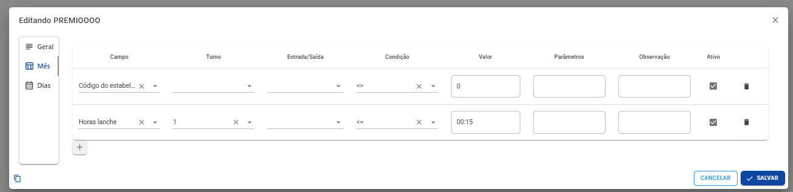
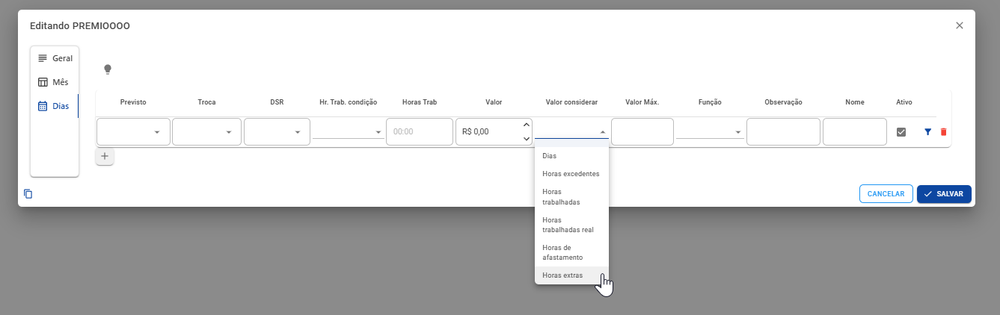

## Filtros para Consulta Diária ✨

- Realizado adição de filtro do tipo trabalhado (Todos, Extras ou Afastado)
- Realizado adição de filtro do tipo de dispositivo (Todos, Coletor, Celular, Web, Manutenção ou Manutenção Funcionário)
- Realizado ação de filtro do tipo de local (Todos, Empresa, Home Office, Sobreaviso, Cliente, Viagem e Outros)

### Demonstração
- Filtro Afastado
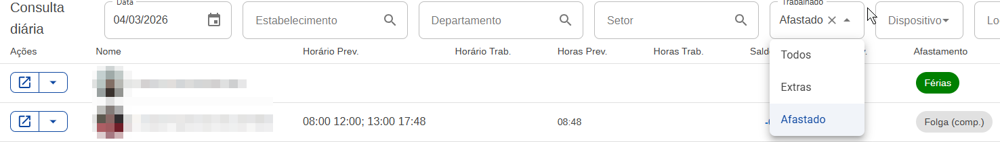

- Filtro Extras
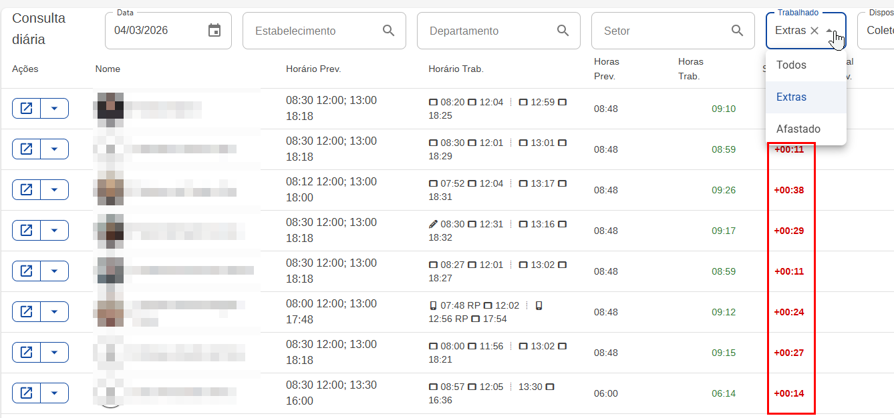

- Filtro com dispositivo e Local
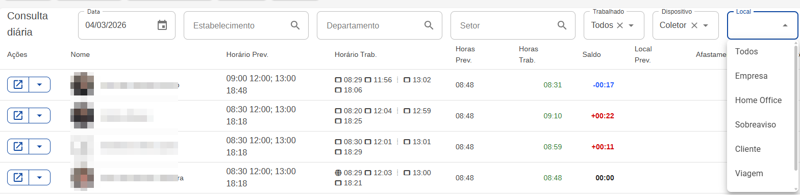

## Tarefa Gerar arquivos fiscais ✨

- Criado a tarefa `TarefaGerarArquivosFiscais`.
- Ajustada a página `ArquivosFiscais` para herdar de `TarefaPageBase` e exibir o progresso da geração.
- Corrigido o processo de compactação no `CalcManager`, onde a geração de arquivos ZIP contendo todos os tipos incluía apenas o último arquivo.

### Demonstração
- Gerar arquivos fiscais  
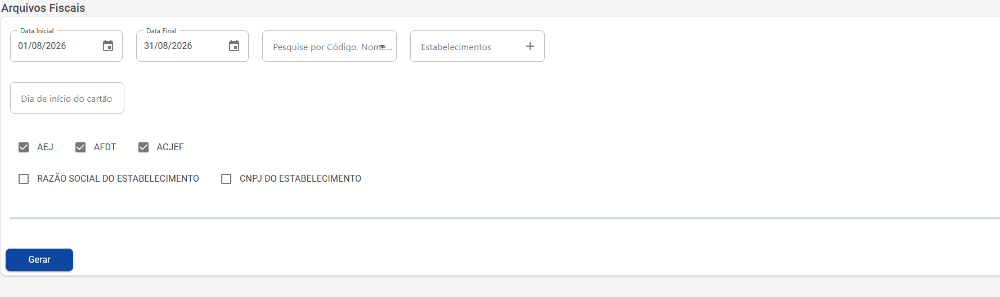

## Ajustes na Exportação da folha

- Adicionado o filtro por **Setor** e reorganizados os filtros de **Cargo**, **Departamento** e **Setor** no menu `Mais Filtros`.
- Ajustada a geração de nomes únicos para os arquivos temporários, utilizando o `Id` desde a geração da Calc e repassando-o para a DLL.

### Demonstração
- Nomes únicos
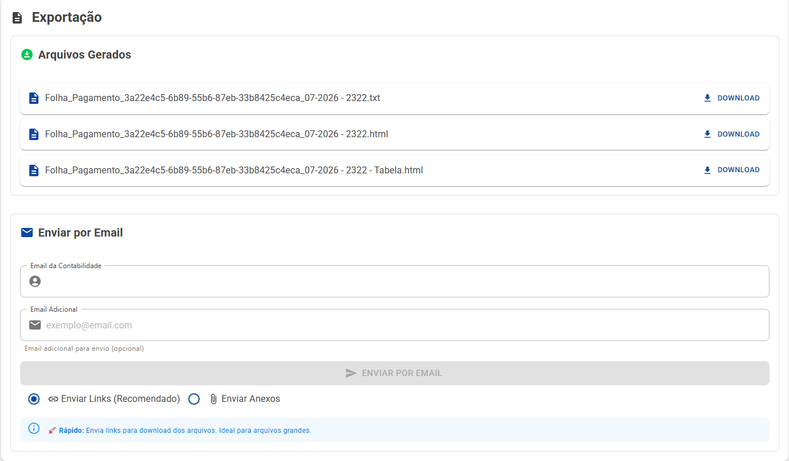

## Formato das horas para o Espelho ✨
- Nova opção para seleção do formato das horas no menu avançado da geração do `Espelho Ponto`:
  - `Horas`: gera os totais no formato atual de horas.
  - `Decimais`: gera os totais no formato decimal. Ex.: `8,0`.
  - `Horas e decimais`: gera os totais nos dois formatos. Ex.: `08:00 (8,0)`.

## Ajustes gerais - 03/08/2026 ♻ [#2278](https://github.com/simixsistemas/Simix.Ponto.Cloud/pull/2278)

### Objetivo

Fix: [#2259](https://github.com/simixsistemas/Simix.Ponto.Cloud/issues/2259)

- Ajustado a sincronização de multicoletores e o layout dos cards para não sobrepor um ao outro.
Melhorias no layout das regras de premios: melhor visualização das regras dos dias e mascara para pr&ncher as horas

## Ajustes gerais no Espelho

- Geração do `Espelho Ponto` pela Manutenção passou a ser executada via tarefas.
- Cálculo de dados realizado sempre durante a geração do `Espelho Ponto`.
- Tratamento do modo de cálculo adicionado ao cálculo de dados, com base na versão anterior do código.
- Definido o cálculo dos períodos anterior, atual e futuro durante a geração do `Espelho Ponto`.

## Ajustes e filtro global Consulta diária

- Realizado ajustes ao salvar as propriedades do espelho ponto após assinar
- Realizado ajuste para visualizar a consulta do ponto quando colaborador e configuração de apenas visualizar o ponto.
- Realizado ajuste de ocultar o filtro da página consulta diária quando o mesmo filtro estiver configurado no filtro global.
- Realizado ajuste da pendencia ao criar um novo pela página

### Demonstração
- Filtro global oculta campo de filtro na consulta diária 
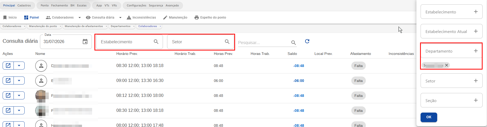

## Filtrar estab enviar colaboradores

- Ajustado o envio dos colaboradores para o equipamento ponto, filtrando pelo estabelecimento para realizar o envio.
- Nova opção de excluir cadastros do equipamento ponto,
- Testado sincronizar múltiplos coletores e funcionou corretamente.

### Demonstração

##  Ajustes/melhorias nos dashboards e tarefas

- Tratamento para sempre exibir o menu gerencial para usuários admin e para usuários que possuem a permissão `Acessar Dashboards Gerenciais`.
- Dashboards sempre exibem para usuários Símix.
- Nova permissão: `Acessar Dashboards Gerenciais`.
- Ajustes tarefas:
  - Criado o comando SQL para aumentar o tamanho da coluna `Apelido`.
  - Tratamento para passar EmpresaInfo como vazio, nas tarefas.

## Opção de horas trabalhadas sem horas de intrajornada

### Objetivo
https://github.com/simixsistemas/Simix.Ponto.Cloud/issues/2249

### Alterações
- Opção para as horas de intrajornada não serem subtraídas das horas trabalhadas. 

### Demonstração
- Campo na guia extras 2 do quadro de horários.
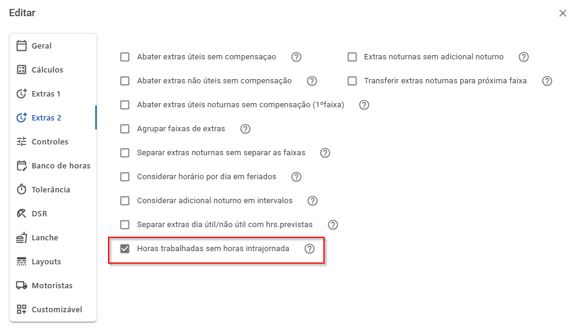

## Visão para o Espelho do ponto.✨ [#2248](https://github.com/simixsistemas/Simix.Ponto.Cloud/pull/2248)

### Objetivo

Fix: [#2239](https://github.com/simixsistemas/Simix.Ponto.Cloud/issues/2239)

### PR's referências
- [Visão para o Espelho do ponto.✨ RX](https://github.com/simixsistemas/DevShare.RX.Cloud/pull/128)

### Alterações
- **Geração do Espelho Ponto:** adicionado o ícone de visões para permitir ocultar campos ou utilizar a visualização padrão.
- Adicionada a possibilidade de ocultar os seguintes campos no Espelho Ponto:
  - `Horário padrão` (Cabeçalho)
  - `Dias de faltas` (Totais)
  - `Lançamentos de BH` (Totais)
  - `Horas de repouso remunerado` (Totais)
  - `Dias de repouso remunerado` (Totais)
- Adicionada a função seed para criação da visão padrão via `DbMigrator` e criada a função SQL para execução manual.

### Demonstração
- Espelho ponto modal.
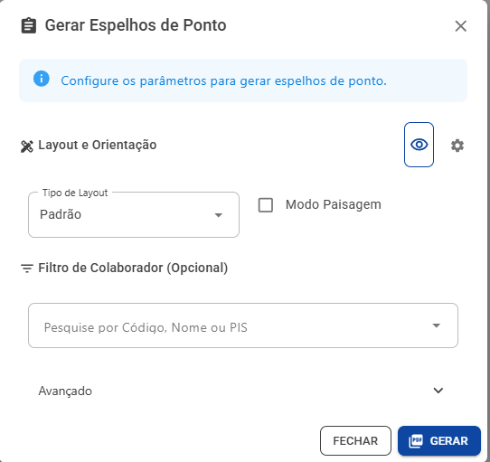

- Seleção de visão.
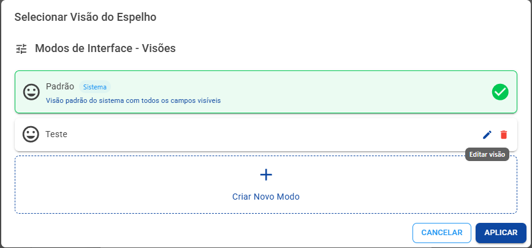

- Edição visão.
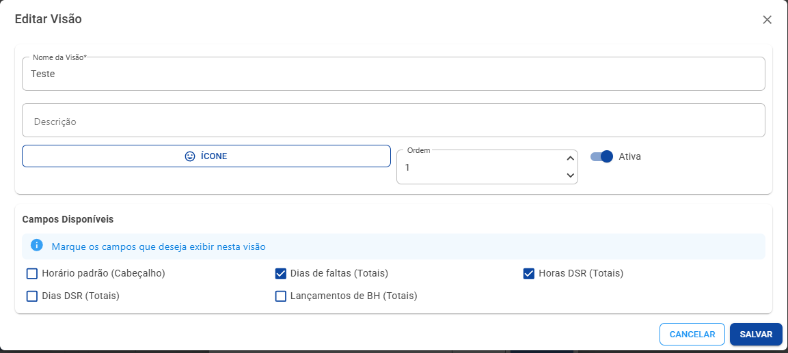

- Espelho Ponto.
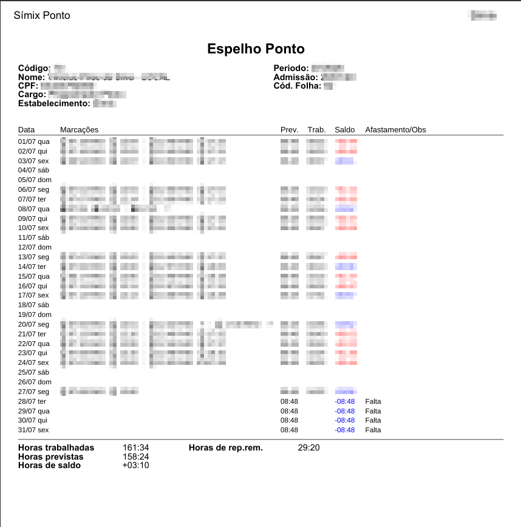

##  Modo para o Calcular dados.✨ [#2245](https://github.com/simixsistemas/Simix.Ponto.Cloud/pull/2245)

### Objetivo

Fix: [#2041](https://github.com/simixsistemas/Simix.Ponto.Cloud/issues/2041)

### Alterações
- Adicionados dois modos de cálculo de dados na geração do Espelho Ponto:
  - **Automático:** calcula apenas os períodos com `Atualizar = 1`, alterando o valor para `0` após a execução e respeitando os filtros aplicados.
  - **Todos:** executa o cálculo padrão de todos os períodos, respeitando os filtros aplicados.

## Registro e Sincronização pelo serviço

- Processa o registro na tarefa
- Processa a sincronização na tarefa, por padrão

## Múltiplos códigos da folha - Campos customizáveis

- Adicionado os múltiplos do código na folha, opção de adicionar uma regra para o código da folha filtrando pelo estabelecimento ou pelo grupo do estabelecimento, sendo assim ao exportar caso tenha uma regra, será utilizado o código cadastrado na regra.

### Demonstração

# Atualizacao - Sem_Iteracao 🎉

### **Esta atualizacao atende a tickets de clientes**

# Documentacao 📝

## Regras premio - Horas extras/Turno horas de lanche ♻ [#454](https://github.com/simixsistemas/Simix.Ponto.Calc/pull/454)

### Objetivo

Fix: [#2266](https://github.com/simixsistemas/Simix.Ponto.Cloud/issues/2266)

### Alterações
- Realizado o tratamento para identificar o turno na regra de Horas lanche.
- Adicionado a opção de Horas Extras nas regras de premio dias.

### Demonstração

## Regras de prêmio na tabela.✨ [#453](https://github.com/simixsistemas/Simix.Ponto.Calc/pull/453)

### Objetivo

Fix: [#2288](https://github.com/simixsistemas/Simix.Ponto.Cloud/issues/2288)

### PR's referências
 - [Ajustes na Exportação da folha.♻](https://github.com/simixsistemas/Simix.Ponto.Cloud/pull/2293)
 
### Alterações
- Adicionada a propriedade `ExportacaoId`para geração de nomes únicos nos arquivos exportados.
- Adicionado o tratamento para inclusão das regras de prêmio na tabela HTML da exportação da folha.

### Demonstração
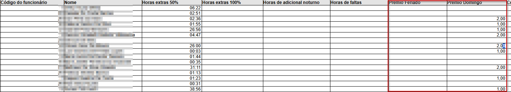

## Ajuste na soma do sobreaviso na PontoCalcPonto [#452](https://github.com/simixsistemas/Simix.Ponto.Calc/pull/452)

### Objetivo

### Alterações
- Alterado local onde acumula sobreaviso na pontocalcponto

## Sincronização - Verificar dois contratos [#451](https://github.com/simixsistemas/Simix.Ponto.Calc/pull/451)

### Objetivo

- 2 contratos não esta designando corretamente os registros.

### Alterações
- Realizado ajustes na verificação dos dois contratos quando sincronizado o coletor, estava validando apenas se fosse feito uma reimportação, agora esta verificando corretamente ao importar o registro ao sincronizar o coletor.
- Criado novos testes para verificar estes casos.

## Ajuste na importação de registros Web 🐛 [#450](https://github.com/simixsistemas/Simix.Ponto.Calc/pull/450)

### Objetivo

Evitar problemas de entrar os registros no layout inverso.

### Alterações

- Agora dá prioridade para o layout atual sempre, como todos suportam as sigla do turno
- Alterado para usar sempre o TurnosEx em vez do TurnosEspeciais
- Tratamento para o tipo de dispositivo

## Otimização ao carregar/atualizar totais ✨ [#449](https://github.com/simixsistemas/Simix.Ponto.Calc/pull/449)

### Objetivo

Otimizar/ajustar o Calcular para que faça todos os totais em uma etapa ao carregar. Pela Manutenção estava executando duas vezes sempre, por causa do BH.

### Alterações

- Alterado para fazer nessa ordem ao carregar: Atualizar todas das propriedades de totais, Carregar o BH, Atualizar a coleção de Totais. Assim fica tudo atualizado somente com uma chamada.
- Ajustes de descrições duplicadas nas Extras BH
- Mais informações para o DebuggerDisplay das classes

## Ajuste no formato da data do arquivo AEJ [#448](https://github.com/simixsistemas/Simix.Ponto.Calc/pull/448)

### Objetivo
https://github.com/simixsistemas/Simix.Ponto.Cloud/issues/2250

### Alterações
- Ajuste no formato da data do tipo de registro 07 no arquivo AEJ

## Regra para buscar turno de extra de intrajornada [#447](https://github.com/simixsistemas/Simix.Ponto.Calc/pull/447)

### Objetivo
https://github.com/simixsistemas/Simix.Ponto.Cloud/issues/2249

### Alterações
- Ajuste na função que vai verificar qual turno está mais próximo do intervalo real e realizar a soma das extras de intrajornada.
- Calculo da opção que exclui as horas de intrajornada no saldo de horas trabalhadas

### Demonstração
- Testes de alguns dias sem subtrair intrajornada do saldo de horas trabalhadas e com nova regra.
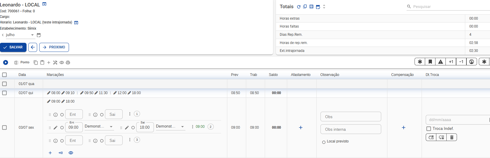
- Testes com quadro de horário com intervalo na meia noite.
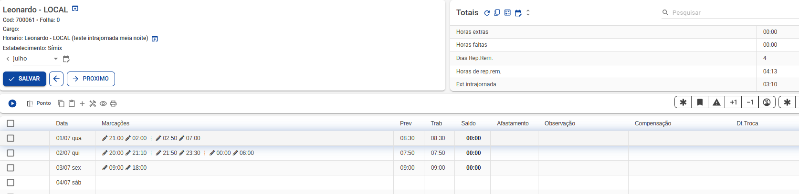

## Ajuste reimportar comprovantes ♻ [#446](https://github.com/simixsistemas/Simix.Ponto.Calc/pull/446)

### Objetivo

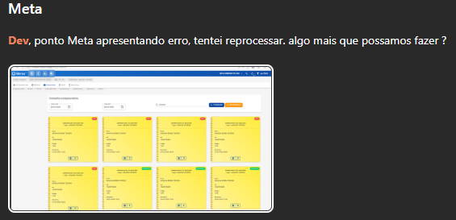

### Alterações
- Ajustado a reimportação dos registros exibidos na tela de comprovantes.

### Demonstração
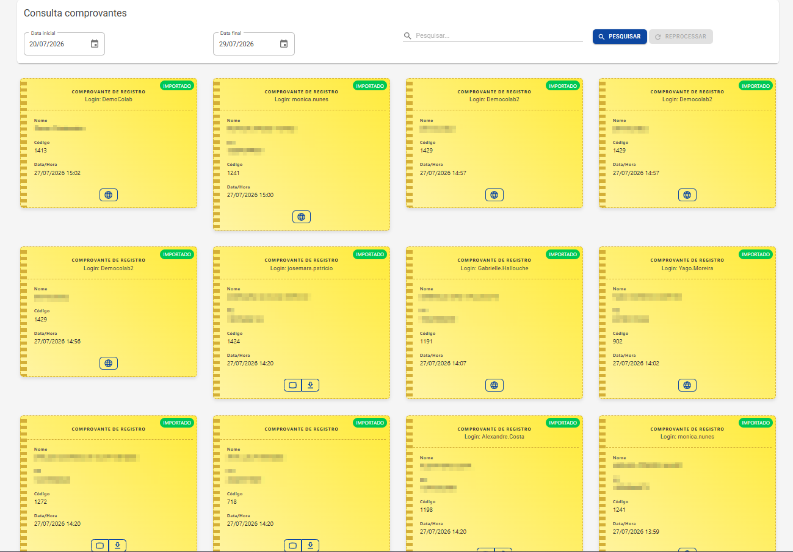

## Múltiplos códigos da folha - Campos customizáveis♻ [#445](https://github.com/simixsistemas/Simix.Ponto.Calc/pull/445)

### Objetivo

Fix: [#2187](https://github.com/simixsistemas/Simix.Ponto.Cloud/issues/2187)

### Alterações
- Adicionado os múltiplos do código na folha, opção de adicionar uma regra para o código da folha filtrando pelo estabelecimento ou pelo grupo do estabelecimento, sendo assim ao exportar caso tenha uma regra, será utilizado o código cadastrado na regra.

### Demonstração
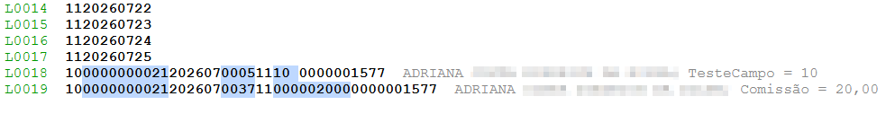

# Atualizacao - Sem_Iteracao 🎉

### **Esta atualizacao atende a tickets de clientes**

# Documentacao 📝

## Filtrar estab. ao enviar colab. para coletor/ Opção excluir colab. coletor ✨ [#18](https://github.com/simixsistemas/Simix.Ponto.Integracoes/pull/18)

### Objetivo

Fix: [#2215](https://github.com/simixsistemas/Simix.Ponto.Cloud/issues/2215)

### Alterações
- Ajustado o envio dos colaboradores para o equipamento ponto, filtrando pelo estabelecimento para realizar o envio.
- Nova opção de excluir cadastros do equipamento ponto,
- Testado sincronizar múltiplos coletores e funcionou corretamente.

### Demonstração
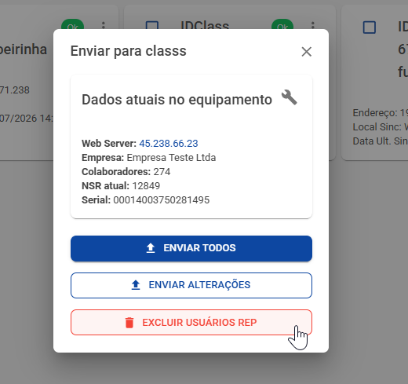
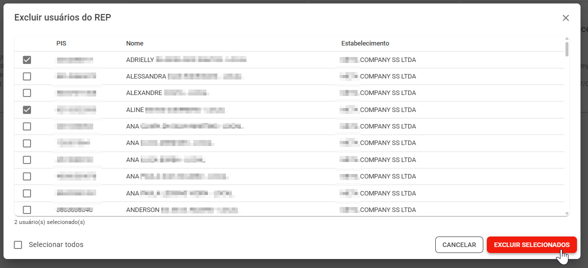

# Atualizacao - Sem_Iteracao 🎉

### **Esta atualizacao atende a tickets de clientes**

# Documentacao 📝

## Ajustes filtro de período.♻ [#132](https://github.com/simixsistemas/DevShare.RX.Cloud/pull/132)

### Objetivo

Fix: [2287](https://github.com/simixsistemas/Simix.Ponto.Cloud/issues/2287)

### PR's referências
- [Melhorias de UI.♻](https://github.com/simixsistemas/Simix.Ponto.Cloud/pull/2303)
### Alterações
- Adicionadas setas de navegação nos dashboards para facilitar a troca de mês.

### Demonstração
- Filtro.
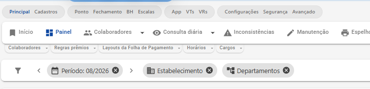

## Formatação de horas no Espelho.♻ [#131](https://github.com/simixsistemas/DevShare.RX.Cloud/pull/131)

### Objetivo

Fix: [#2281](https://github.com/simixsistemas/Simix.Ponto.Cloud/issues/2281)

### PR's referências
- [Formato das horas para o Espelho.✨](https://github.com/simixsistemas/Simix.Ponto.Cloud/pull/2283)

### Alterações
- Nova propriedade `TotalFormat `.
- Tratamento de formatação horas para decimais no espelho ponto.

### Demonstração
- Decimais.
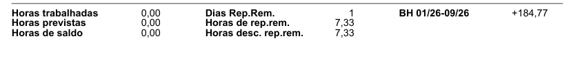

- Horas e decimais.
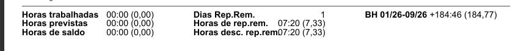

## Melhorias para os dashboards.♻ [#130](https://github.com/simixsistemas/DevShare.RX.Cloud/pull/130)

### Objetivo

Fix: [#2260](https://github.com/simixsistemas/Simix.Ponto.Cloud/issues/2260)

### PR's Referências
[Ajustes gerais.♻- #2271
](https://github.com/simixsistemas/Simix.Ponto.Cloud/pull/2271)

### Alterações
- Ajustes nos widget Tabelas: 
  - Não forçar a formatos ao editar, apenas ao criar o widget.
  - Configuração do hover: Destacar as linhas selecionadas.
- Ajustes na exportação excel:
  - Agora exporta os grupos com os totais.
  - Ajustado para ignorar ícones de registros.

### Demonstração
- Não forçar formato ao editar.
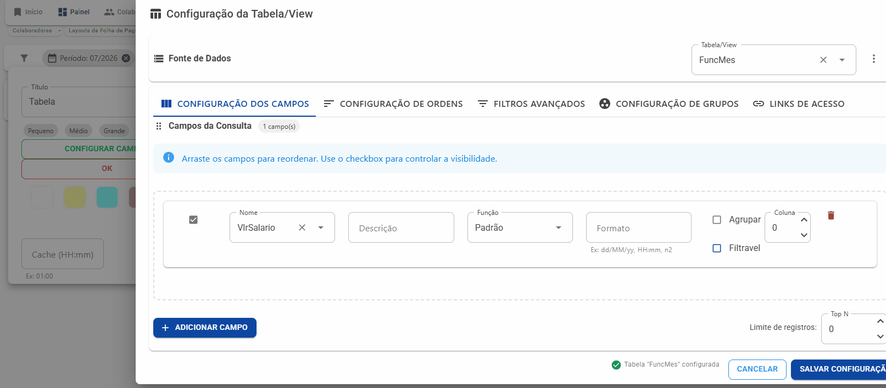

- Destacar linhas selecionar.
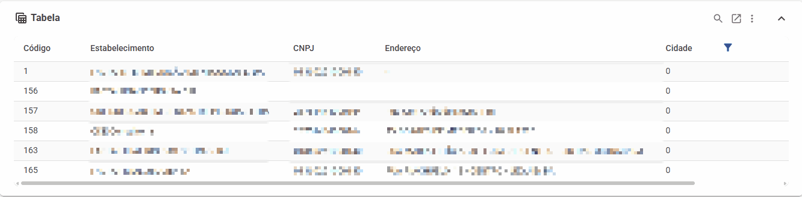

- Filtros no modo expandido.
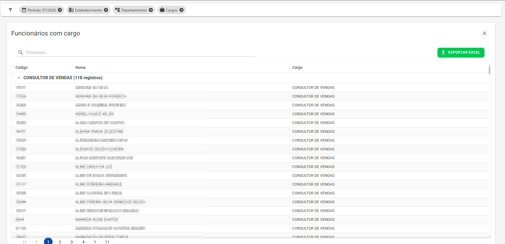
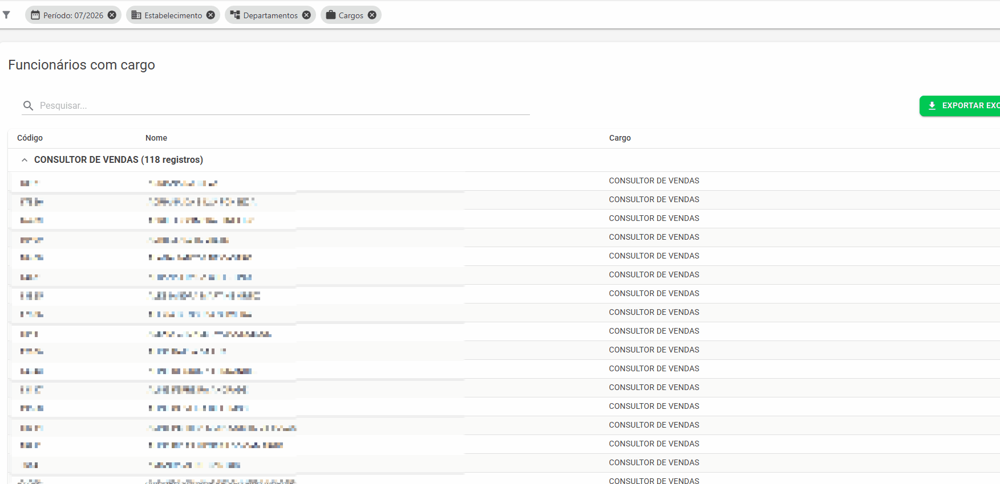

- Exportar excel grupos.
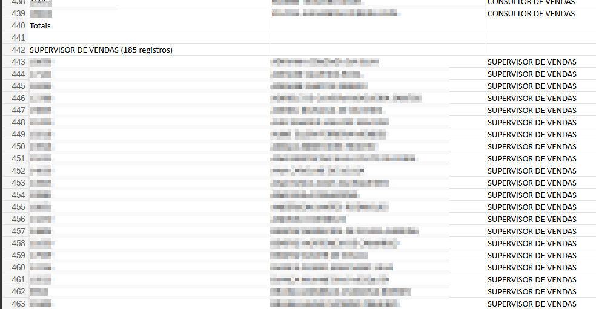

## Melhorias nas permissões dos Dashboards e tratamentos.♻ [#129](https://github.com/simixsistemas/DevShare.RX.Cloud/pull/129)

### Objetivo

Fix: [#2240](https://github.com/simixsistemas/Simix.Ponto.Cloud/issues/2240)
Fix2: [#2257](https://github.com/simixsistemas/Simix.Ponto.Cloud/issues/2257)

### PR's referências
- [Ajustes/melhorias nos dashboards e tarefas.♻](https://github.com/simixsistemas/Simix.Ponto.Cloud/pull/2258)

### Alterações
- Inativação dos menus: Novo, copiar e colar. Caso não tenha permissão da loja.
- Tratamento de erro no ficha cadastral.

### Demonstração
- Tratamento.
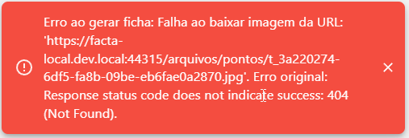

## Visão para o Espelho do ponto.✨ [#128](https://github.com/simixsistemas/DevShare.RX.Cloud/pull/128)

### Objetivo

Fix: [#2239](https://github.com/simixsistemas/Simix.Ponto.Cloud/issues/2239)

### PR's referências
- [Visão para o Espelho do ponto.✨ Simix Ponto](https://github.com/simixsistemas/Simix.Ponto.Cloud/pull/2248)

### Alterações
- Nova propriedade para receber os campos ocultados.
- Tratamento na geração do espelho ponto para ocultar os campos.
