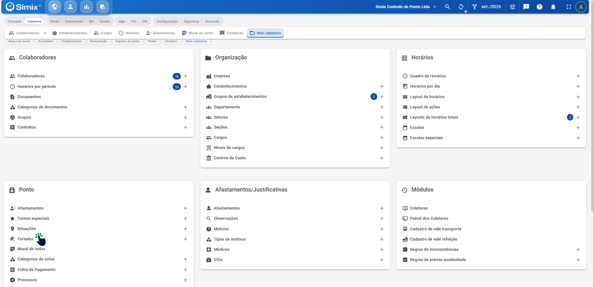
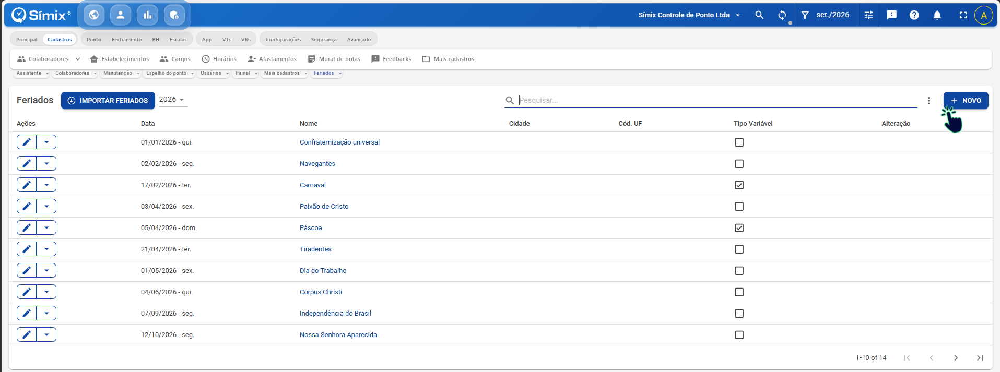
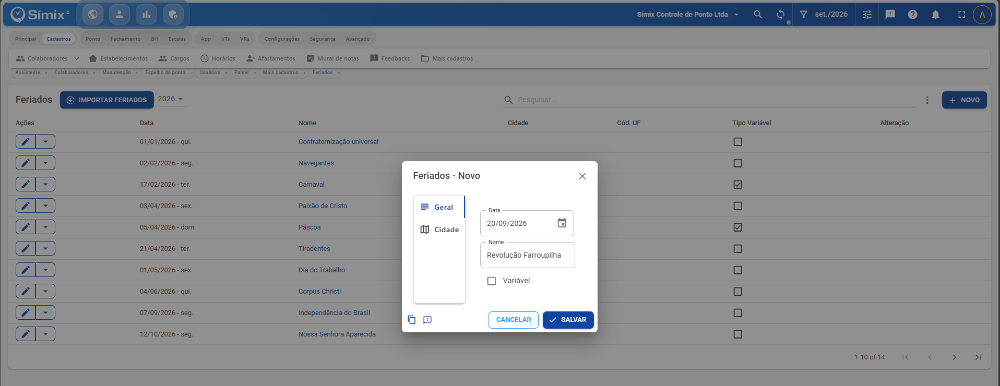
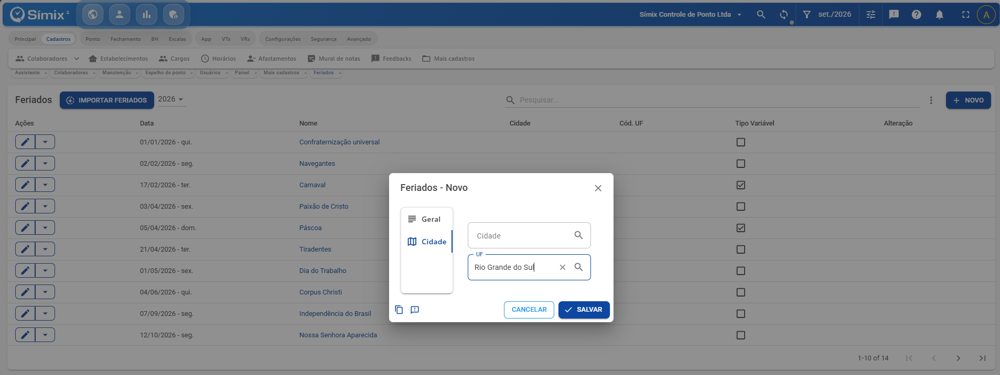
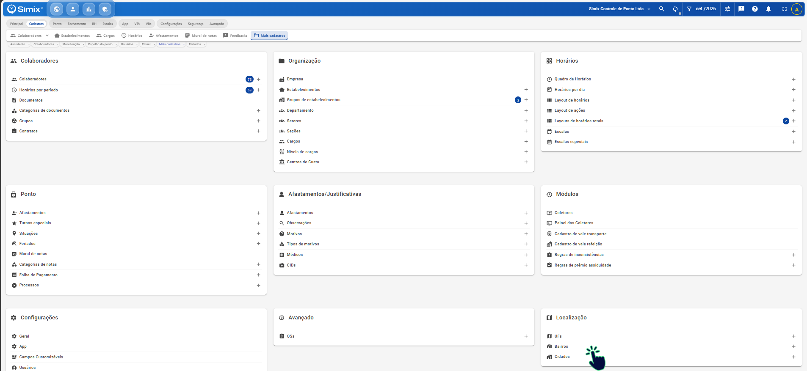
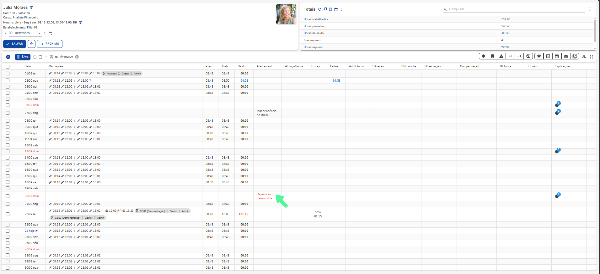
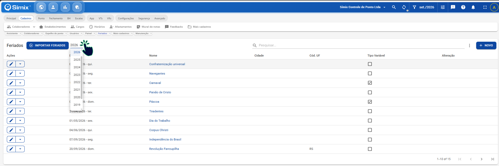

# Como cadastrar feriados na Gestão de Ponto

## Objetivo

Cadastrar feriados locais na Gestão de Ponto para que o sistema considere corretamente datas específicas da sua região ou estabelecimento.

## Passo a passo

1. Acesse **Cadastros > Mais Cadastros > Ponto > Feriados**.

2. Na tela de **Feriados**, clique em **Novo**.

3. Na guia **Geral**, preencha os campos:
   - **Data**: informe a data do feriado.
   - **Nome do Feriado**: informe a descrição ou nome do feriado.
   - **Variável**: marque esta opção se o feriado muda de data a cada ano, como Carnaval ou Páscoa.

   

4. Acesse a guia **Cidade**.

5. Se sua empresa possuir estabelecimentos em mais de uma cidade, selecione a cidade correspondente ao feriado que está sendo cadastrado.

   **Observação:** Se a empresa possuir apenas um estabelecimento ou não utilizar a separação por cidades, o preenchimento desta guia não é obrigatório.

6. Utilize o campo **UF** somente para feriados aplicáveis a um estado inteiro.

7. Clique em **Salvar** para concluir o cadastro.

## Informações importantes

Os feriados nacionais já são disponibilizados automaticamente pelo sistema e não precisam ser cadastrados manualmente.

Caso algum feriado nacional não esteja sendo exibido, utilize o botão **Importar Feriados** para carregar novamente os feriados nacionais.

## Resumo do caminho de navegação

**Cadastros > Mais Cadastros > Ponto > Feriados > Novo**

## Exemplo de uso

Imagine que sua empresa possui uma unidade em Porto Alegre e deseja cadastrar o feriado municipal de Nossa Senhora dos Navegantes.

Preencha o cadastro da seguinte forma:

- **Data:** 02/02/2027
- **Nome do Feriado:** Nossa Senhora dos Navegantes
- **Cidade:** Porto Alegre

Após salvar, a Gestão de Ponto passará a considerar esse feriado para os colaboradores vinculados à cidade selecionada.

## Solução de problemas

### Não encontro a cidade desejada para seleção

Verifique se o cadastro da cidade ou estabelecimento está devidamente configurado no sistema.

Se a cidade não estiver disponível para seleção, revise os cadastros relacionados antes de criar o feriado.

## Dúvidas frequentes

### Preciso cadastrar todos os feriados do ano?

Não. Cadastre apenas os feriados locais ou específicos da sua região que não estejam contemplados automaticamente pelo sistema.

### Posso cadastrar mais de um feriado para a mesma cidade?

Sim. É possível cadastrar quantos feriados forem necessários para uma mesma localidade.

### O cadastro de cidade é obrigatório?

Não. O preenchimento da guia **Cidade** é necessário apenas para empresas que possuem estabelecimentos em diferentes municípios e precisam diferenciar os feriados por localidade.

### Como exibe na manutenção do ponto?

Após o cadastro do feriado, ele será exibido na aba **Afastamento** e o dia será marcado como DSR em vermelho.

Se o colaborador tiver trabalhado, será gerado um saldo positivo de horas extras.

Caso não tenha trabalhado, o dia será considerado uma folga DSR sem gerar saldos negativos.

### Como localizo os feriados dos outros anos?

Ao lado do botão **Importar Feriados** existe o campo **Ano**.

Altere o ano desejado nesse campo para visualizar os feriados cadastrados em outros períodos.

