# Guia de Implantação de Banco e Importação de Funcionários

## 1. Acesso ao Menu Principal
1. Acesse o menu principal. Vá até a aba **Suporte (1)**.
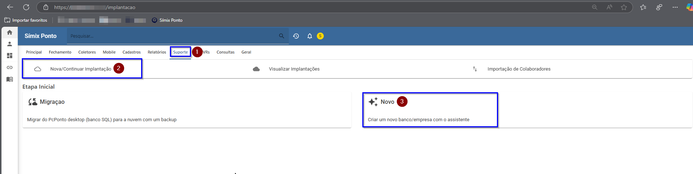

## 2. Iniciando uma Nova Implantação
1. Para iniciar uma implantação, selecione a opção **"Nova/Continuar Implantação" (2)**.
2. Esse botão permite iniciar uma nova implantação ou continuar uma já iniciada.
3. Para criar um novo banco/cliente, clique em **"Novo" (3)**.

## 3. Etapa: Empresa
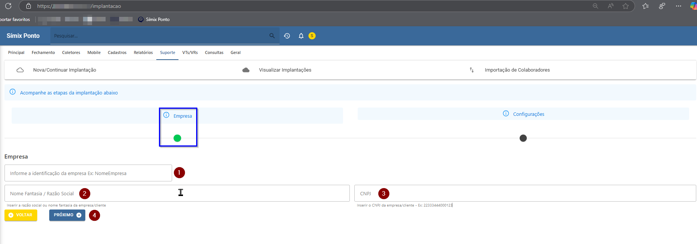
1. Você será direcionado à página **Empresa**(1).
2. No topo da página, haverá uma **timeline** indicando as etapas da configuração do banco.
   - A **bolinha verde** indica a página atual.
   - O nome acima indica a etapa correspondente.
3. Preenchimento dos campos:
   - **(1) Identificação da empresa**: Informe o nome da empresa (será o nome do banco/tenant do cliente).
   - **(2) Nome fantasia/Razão social**: Preencha o nome fantasia ou razão social do cliente/empresa.
   - **(3) CNPJ**: Informe o CNPJ da empresa.
   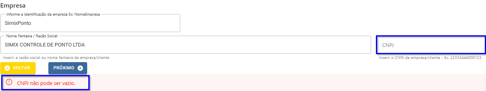
     - Caso o CNPJ esteja em branco, o sistema não permitirá prosseguir.
4. Após preencher os campos obrigatórios, clique em **"Prosseguir"** para a próxima etapa.

## 4. Etapa: Configurações
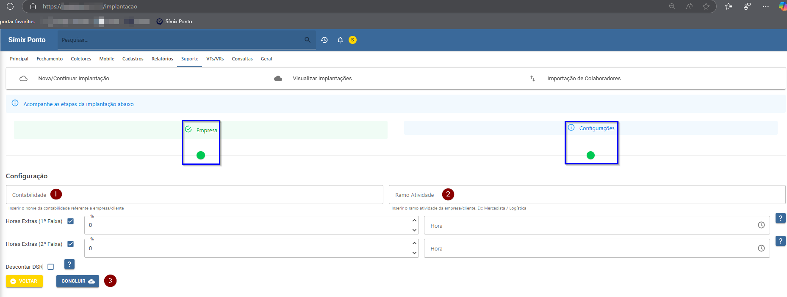
1. A bolinha da timeline na etapa "Empresa" estará verde, indicando que esta etapa foi concluída.
2. Caso interrompa aqui, ao retornar, o sistema abrirá diretamente na etapa **Configurações**.
3. Preenchimento dos campos:
   - **(1) Contabilidade**: Informe o nome da contabilidade da empresa.
   - **(2) Ramo de atividade**: Escolha a área de atuação (ex: Mercadista, Logística, Transportadora).
4. Configuração de Extras:
   - **(1 e 2 Faixa)**: Configure os valores de porcentagem e horas e ative ou desative conforme necessário.
   
   - Há um botão **"?"** que exibe explicações sobre cada extra ao passar o mouse.
   - Também há a opção de ativar **Desconto DSR**.
5. Após preencher todas as informações, clique em **"Concluir"**.

## 5. Conclusão da Implantação
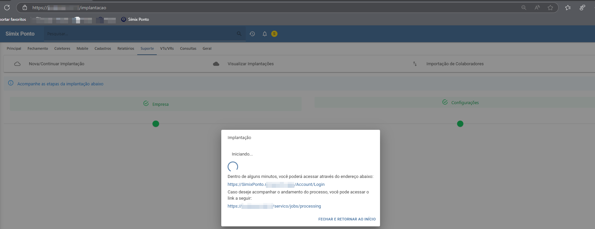
1. Um pop-up aparecerá informando que a implantação está iniciando.
2. O sistema exibirá dois links:
   - **Link de acesso do cliente (tenant)**.
      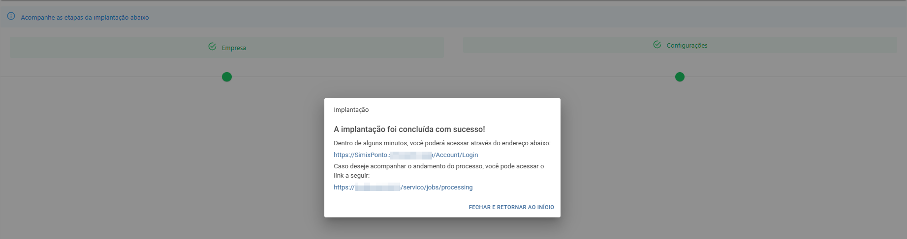
   - **Link de serviços**, onde é possível acompanhar o andamento da implantação.
      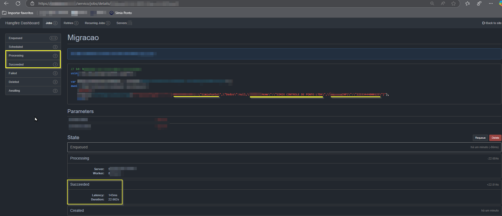
3. Acesse o link do cliente, faça login e você será redirecionado para o sistema.
   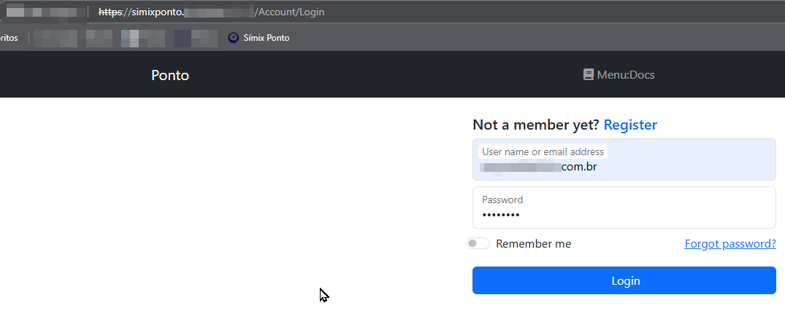

## 6. Importação de Funcionários
1. No **menu principal**, vá até **Suporte**.
2. Clique em **"Importação de Colaboradores"**.
   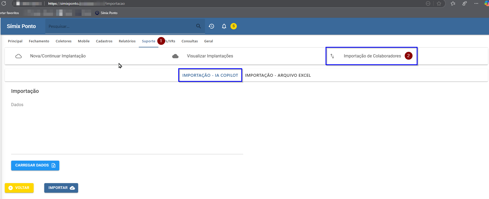
3. Escolha o tipo de importação:
   - **Via Copilot**: Insira um texto com os dados dos funcionários (código, nome completo e PIS/CPF). Clique em **"Carregar Dados"**.
      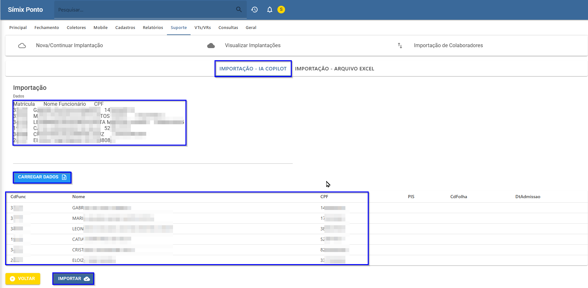
   - **Via Excel**:
     - Selecione o arquivo desejado.
         
     - Mapeie os campos do arquivo com os campos disponíveis na tela.
     - Clique em **"Carregar Dados"** para visualizar a lista importada.
         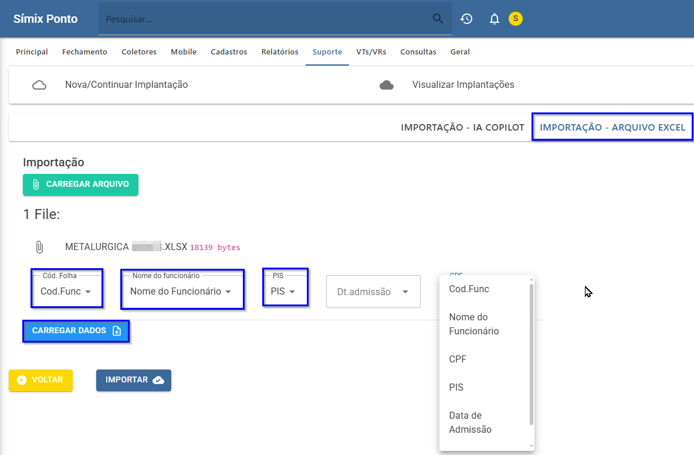
         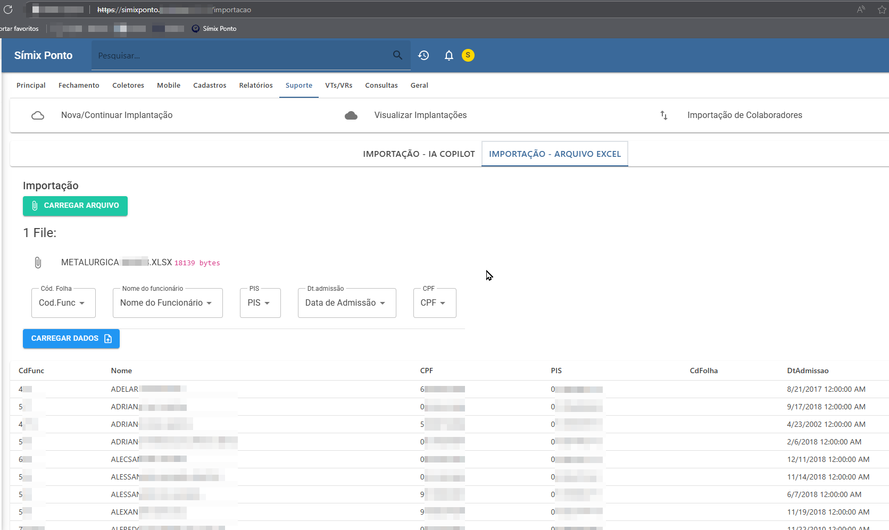
4. Após carregar os dados, clique em **"Importar"**.
    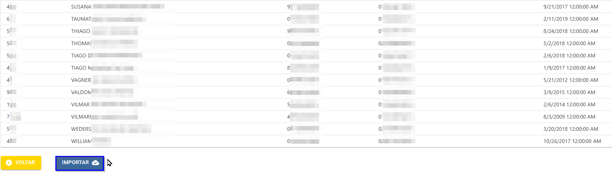

5. Um pop-up confirmará que os funcionários foram importados com sucesso.
    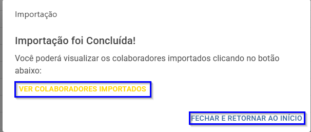
## 7. Finalização
Após a importação dos funcionários, o processo de criação do banco, configuração e importação de colaboradores está concluído.
    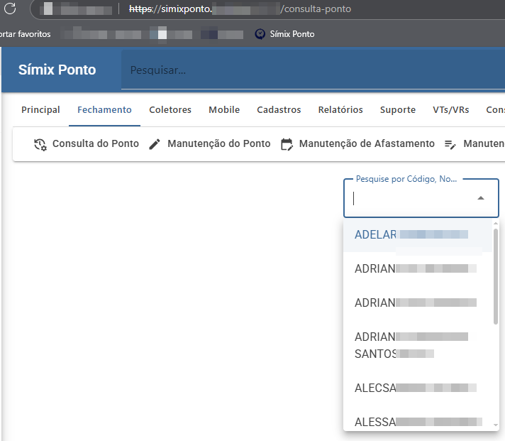

