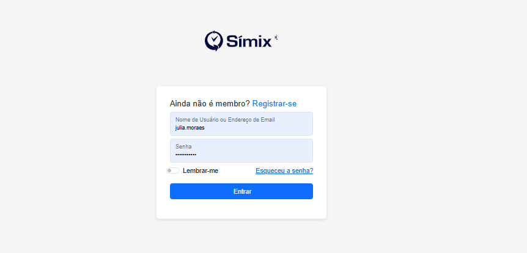
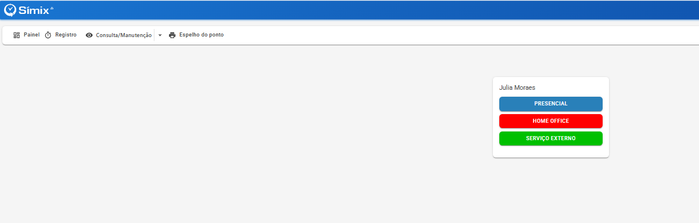
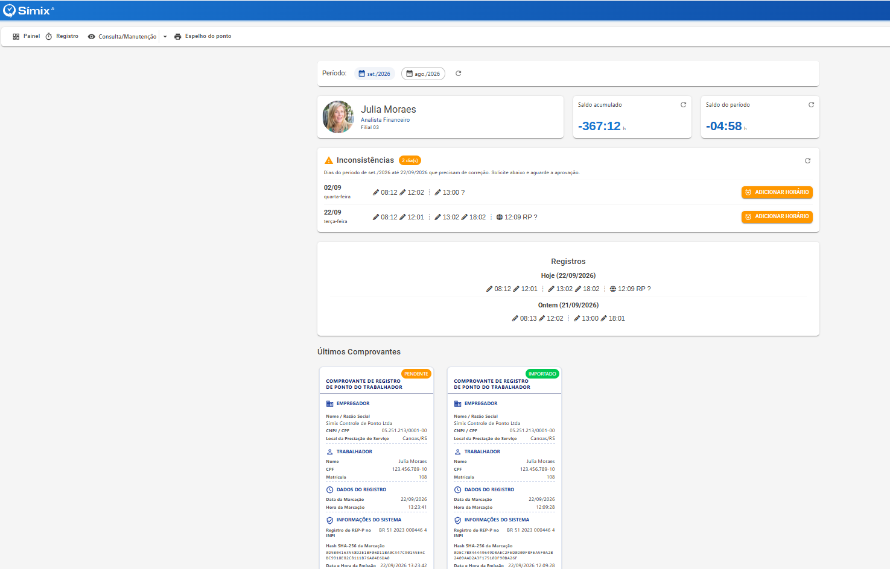
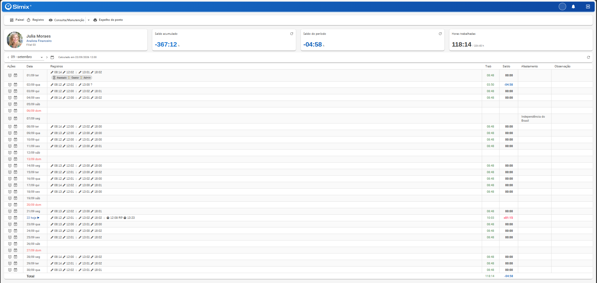
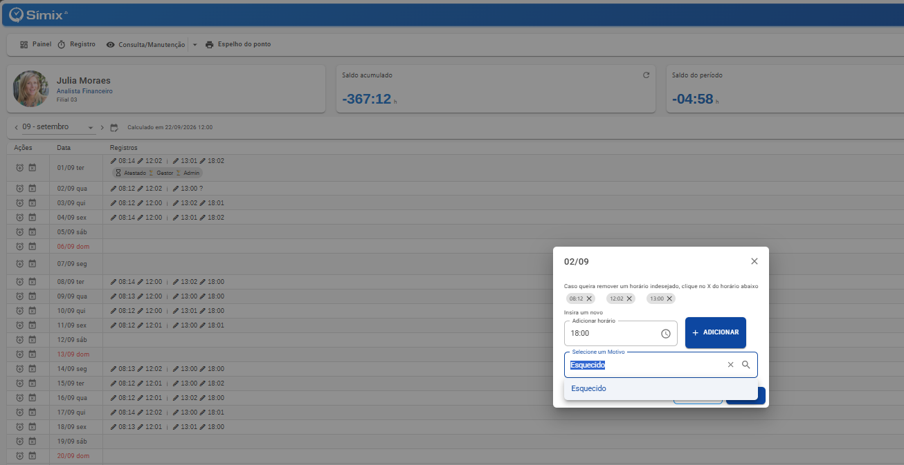
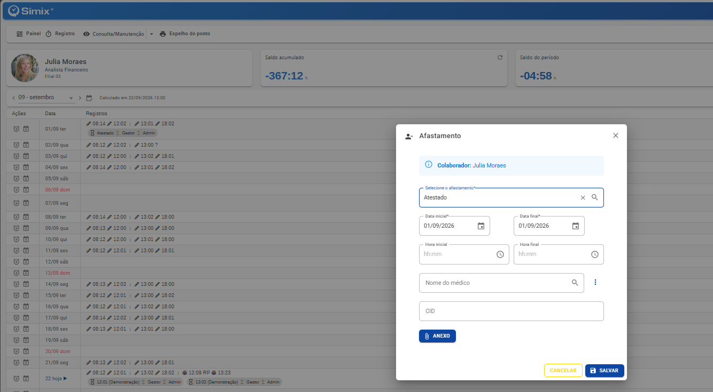
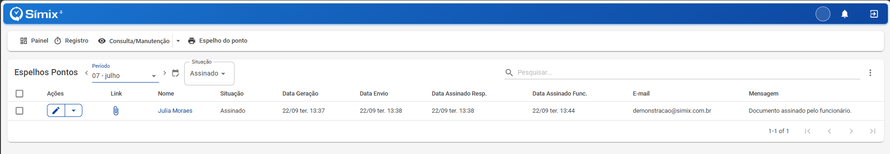
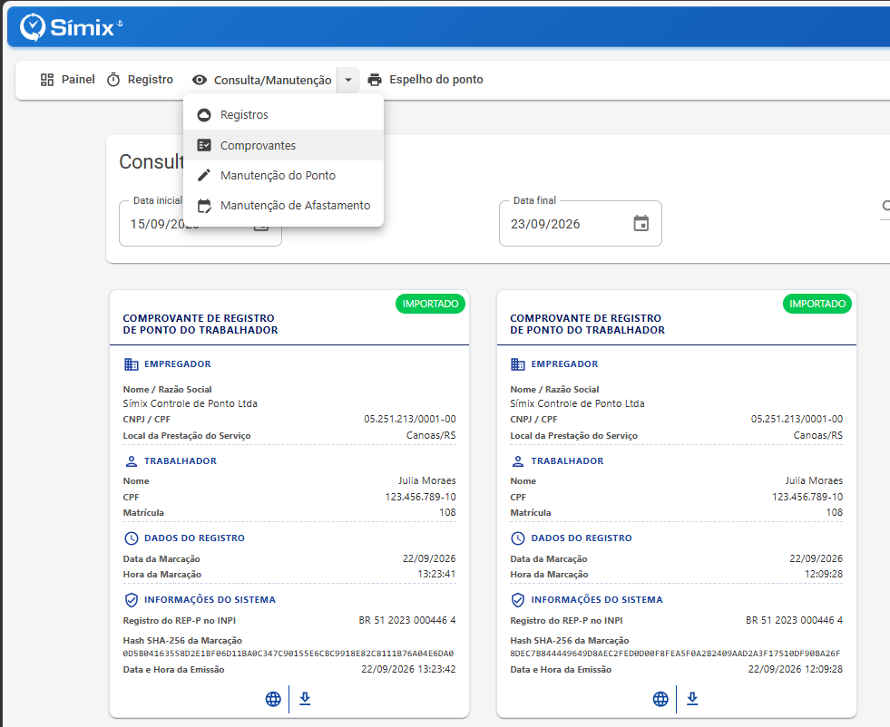

# Como utilizar o módulo Colaborador no Símix Ponto

## Objetivo

Aprenda a acessar e utilizar as principais funcionalidades do módulo Colaborador no Símix Ponto para realizar a gestão do seu ponto e acompanhar suas informações.

## Pré-requisitos

- Acesso ao sistema **Símix Ponto**
- Credenciais válidas de colaborador (usuário e senha)
- Funcionalidades habilitadas pela empresa, como registro de ponto ou solicitação de manutenção

## Passo a passo

### 1. Acesse o sistema

- Acesse o sistema **Símix Ponto**.
- Insira suas credenciais de colaborador nos campos correspondentes.
- Clique em **Entrar**.

### 2. Registre o ponto

- Verifique se a funcionalidade de registro está habilitada para você.
- Clique em **Registrar** para realizar um registro de ponto.
- Algumas empresas podem ter mais de um botão configurado para registro.

### 3. Visualize o painel  do colaborador

**Menu > Painel**

- Visualize um resumo das principais informações:
  - **Saldos**
  - **Últimos Comprovantes**
  - **Últimos Espelhos de Ponto**
  - Ajuste de **Inconsistências no ponto**
  

### 4. Consulte e acompanhe o cartão de ponto

**Menu> Consulta / Manutenção**

- Visualize as seguintes informações:
  - Cadastro do funcionário
  - Resumo de saldos do mês
  - Registros realizados

  

### 5. Solicite ajustes de ponto

**Consulta/Manutenção > Ações**

- Clique no ícone de **mais (+)**.
- Insira um novo registro de ponto.
- Selecione um motivo.
- Finalize a solicitação.
- A solicitação ficará **pendente de aprovação pelo RH**.

### 6. Insira afastamentos

**Consulta Manutenção > Ações**

- Clique no ícone de **X**.
- Informe os dados do afastamento:
  - Horas de afastamento
  - Nome do médico
  - Código **C.I.D. (Classificação Internacional de Doenças)**
- Anexe o documento correspondente, como um atestado médico.
- Clique em **Salvar**.

### 7. Acesse os espelhos de ponto

**Menu > Espelho de ponto**

- Visualize os espelhos enviados pelo RH para o seu e-mail.
- Utilize os filtros disponíveis:
  - **Período**
  - **Situação**
- Para baixar o documento, clique em **Link**.

### 8. Consulte registros e comprovantes

**Menu  > Consultas**

- Visualize:
  - Registros de ponto
  - Comprovantes de ponto
  - Solicitações de manutenção de ponto
  - Solicitações de afastamento
- Para baixar um comprovante, utilize a opção de **download em PDF**.
- Acompanhe o status das solicitações diretamente nesta tela.

